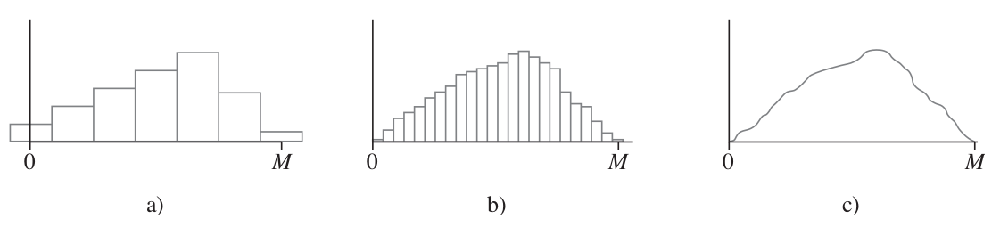
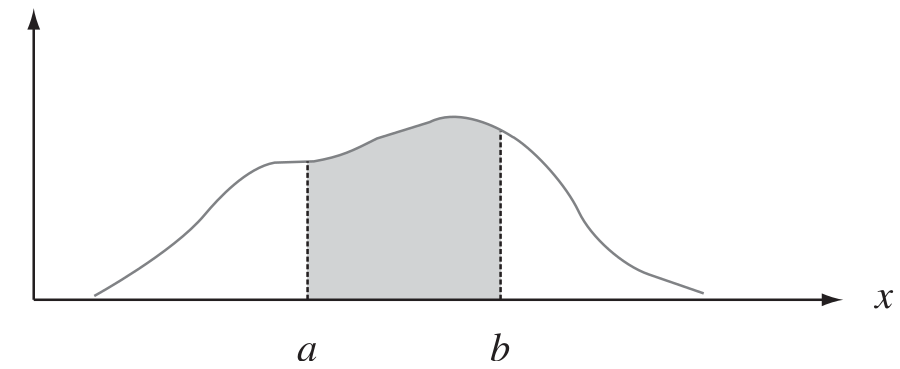
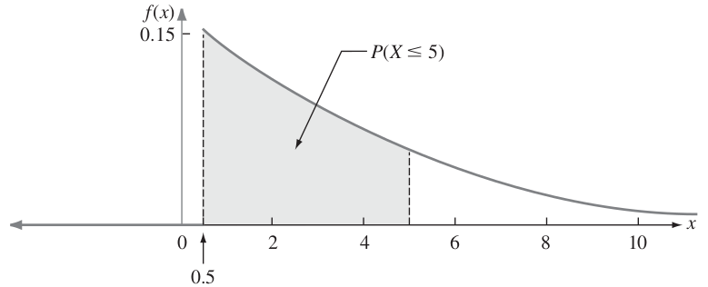
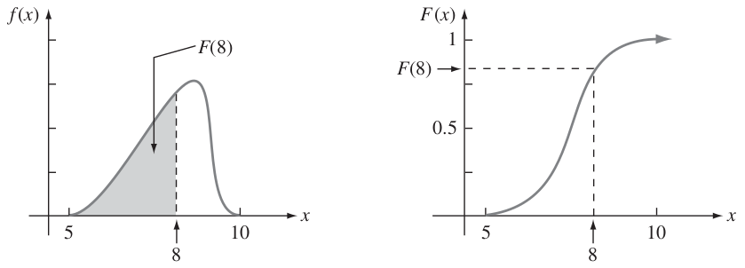
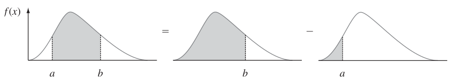

# Probabilidad y variables aleatorias

## Elementos de probabilidad

Los elementos de probabilidad son los conceptos fundamentales que se utilizan en la teoría de la probabilidad para describir y analizar eventos aleatorios. Algunos de ellos son: espacio muestral, eventos, función de probabilidad, variable aleatoria, distribución de probabilidad, entre otros.

Estos elementos son esenciales para el estudio de la probabilidad y su aplicación en la estadística y en muchas áreas de la ciencia, incluyendo la economía, la biología, la física, entre otras.

### Experimento y Espacio muestral 

En el contexto de la probabilidad, un **experimento** es definido como un proceso que genera resultados definidos. Y en cada una de las repeticiones del experimento, habrá uno y solo uno de los posibles resultados experimentales [@anderson, página 143].

:::: {.blackbox}
::: {.example}
```{r experimentos, echo=FALSE}
tabla = matrix(c("Lanzar una moneda",
                 "Tomar una pieza para inspeccionarla",
                 "Realizar una llamada de ventas",
                 "Lanzar un dado",
                 "Jugar un partido de fútbol",
                 "Cara, cruz",
                 "Con defecto, sin defecto",
                 "Hay compra, no hay compra",
                 "1, 2, 3, 4, 5, 6",
                 "Ganar, perder, empatar"),
               byrow = F, ncol = 2)
kbl(tabla, align = 'l', booktabs = TRUE, linesep = "", escape = FALSE,
      caption = "Experimentos y resultados",
      col.names = c("Experimento", "Resultado experimental")) |>
  kable_styling(full_width = FALSE, bootstrap_options = c("condensed"), latex_options = c("HOLD_position")) |>
  scroll_box(box_css = "border: 0px; ", extra_css = "overflow-x: auto; ")
```
:::
::::

Al especificar todos los resultados experimentales posibles, se está definiendo el **espacio muestral** de un experimento. En otras palabras, el espacio muestral de un experimentos es el conjunto de todos los resultados experimentales. Se usa la letra omega mayúscula ($\Omega$) para referirnos a este conjunto. Un elemento genérico de $\Omega$ se denota como $\omega$.

:::: {.blackbox}
::: {.example}
Conduciendo hacia su trabajo, una persona debe pasar por tres semáforos. En cada cruce la persona puede detenerse (D) o continuar (C), de acuerdo con el color de la luz. ¿Cuál es el espacio muestral del experimento?

$$\Omega = \lbrace CCC, DDD, CCD, CDD, CDC, DCD, DDC, DCC \rbrace$$
:::
::::

::: {.exercise}
Un fabricante de ropa deportiva produce pantalones deportivos en dos colores (azul y gris) y en cuatro tamaños diferentes (pequeño, mediano, grande y extra grande). ¿Cuál es el espacio muestral del experimento de elegir al azar un pantalón deportivo de la línea de producción de la empresa?
:::

::: {.exercise}
Un restaurante ofrece tres opciones de menú para el almuerzo: menú A, menú B y menú C. Además, cada menú se puede pedir con carne o con pescado. ¿Cuál es el espacio muestral del experimento de elegir al azar un menú para el almuerzo en este restaurante?
:::

::: {.exercise}
Una compañía de seguros de autos ofrece pólizas de seguro con dos niveles de cobertura (básico y completo) y dos tipos de franquicia (alta y baja). ¿Cuál es el espacio muestral del experimento de elegir al azar una póliza de seguro de auto de la compañía?
:::

### Eventos aleatorios

En principio, un **evento aleatorio** (o simplemente evento) es algún subconjunto del espacio muestral $\Omega$. Los eventos se anotan con una letra mayúscula a elección [@anderson, página 153].

A modo de ejemplo, consideren el experimento de lanzar un dado de 6 caras. 

$\Omega = \lbrace 1,2,3,4,5,6 \rbrace$

Luego, el evento correspondiente a obtener un número par está dado por:

A: obtener un número par $\rightarrow A = \lbrace 2,4,6 \rbrace$

::: {.exercise}
Experimento aleatorio: Lanzamiento de un dado. Evento aleatorio: Obtener un número impar. ¿Cuál es el conjunto correspondiente al evento aleatorio?
:::

::: {.exercise}
Experimento aleatorio: Elegir una carta al azar de una baraja inglesa de 52 cartas. Evento aleatorio: Obtener una carta roja. ¿Cuál es el conjunto correspondiente al evento aleatorio?
:::

::: {.exercise}
Experimento aleatorio: Lanzar dos monedas. Evento aleatorio: Obtener dos caras. ¿Cuál es el conjunto correspondiente al evento aleatorio?
:::

::: {.exercise}
Experimento aleatorio: Elegir un estudiante al azar de una clase de 30 estudiantes. Evento aleatorio: Elegir a un estudiante que tenga una altura superior a 1,75 metros. ¿Cuál es el conjunto correspondiente al evento aleatorio?
:::

::: {.exercise}
Experimento aleatorio: Lanzar un dardo a una diana circular (el centro y 6 sectores circulares). Evento aleatorio: Obtener un lanzamiento dentro del círculo exterior de la diana. ¿Cuál es el conjunto correspondiente al evento aleatorio?
:::

### Probabilidad de un evento {#probabilidad-evento}

El concepto de probabilidad está asociado a la ocurrencia de un evento Sin embargo, el número que determina que tan factible es que dicho evento ocurra puede ser difícil de calcular. En este aspecto, como introducción, se hará uso de la definición clásica de probabilidad:

<center>*Probabilidad de que ocurra un evento* $= \displaystyle\frac{\text{Casos favorables}}{\text{Casos totales}}$</center>

Por ejemplo, la probabilidad de obtener un número par al lanzar un dado una vez es:

A: obtener un número par. $\rightarrow A = \lbrace 2,4,6 \rbrace$

$$P(A) = \frac{\text{Casos favorables}}{\text{Casos totales}} = \frac{\lbrace 2,4,6 \rbrace}{\lbrace 1,2,3,4,5,6 \rbrace} = \frac{3}{6}= \frac{1}{2}$$
**Nota:** La probabilidad de cualquier evento siempre estará entre 0 y 1. Los casos extremos suceden cuando los casos favorables son inexistentes o son la totalidad de casos posibles respectivamente.

::: {.exercise}
En una tienda de ropa hay 10 camisas rojas, 15 camisas azules y 20 camisas verdes. ¿Cuál es la probabilidad de que al escoger una camisa al azar, sea de color verde?
:::

::: {.exercise}
En un mercado hay 200 vendedores, de los cuales el 70% son hombres y el 30% son mujeres. Si se elige al azar un vendedor, ¿cuál es la probabilidad de que sea mujer?
:::

#### Propiedades

A continuación se mencionan algunas propiedades relacionadas con probabilidades [@anderson, página 157].

1.  **Complemento de un evento:** Dado un evento $A$, el complemento de $A$ se define como el evento que consta de todos los casos muestrales que **no** están en $A$, y se denota por $A^c$. Por ejemplo, si consideramos el experimento de lanzar el dado, y el evento de obtener un número par ($A$), entonces, el complemento corresponde a obtener un número que no sea par ($A^c$). De lo anterior se tiene que
    
    ```{=tex}
    \begin{equation}
    P(A) + P(A^c) = 1
    (\#eq:complemento)
    \end{equation}
    ```
    :::: {.blackbox}
    ::: {.example}
    Considere el caso de un administrador de ventas que, después de revisar los informes de ventas, encuentra que el 80% de los contactos con clientes nuevos no producen ninguna venta. Si $A$ denota el evento **hubo venta**, entonces $A^c$ corresponde al evento de **no hubo venta**. Si el administrador tiene que $P(A^c) = 0.8$, mediante la ecuación \@ref(eq:complemento) se ve que

    $$P(A) = 1 - P(A^c) = 1 - 0.8 = 0.2$$
    La conclusión es que la probabilidad de una venta en el contacto con un cliente nuevo es de 0.2.
    :::
    ::::

2.  **Unión de dos eventos:** La unión de dos eventos $A$ y $B$ es el evento que contiene todos los casos muestrales que pertenecen a $A$ o $B$ o ambos. La unión se denota $A \cup B$.

3.  **Intersección de dos eventos:** Dados dos eventos $A$ y $B$, la intersección de $A$ y $B$ es el evento que contiene los casos muestrales que pertenecen tanto a $A$ como a $B$. La intersección se denota $A \cap B$.

4.  **Ley de la adición:** La ley de la adición proporciona una manera de calcular la probabilidad de que ocurra el evento $A$ o el evento $B$ o ambos. En otras palabras, esta ley se emplea para calcular la probabilidad de la unión de dos eventos. La ley de la adición se expresa de la siguiente manera.

    ```{=tex}
    \begin{equation}
    P(A\cup B) = P(A) + P(B) - P(A\cap B)
    (\#eq:leyadicion)
    \end{equation}
    ```
    
    :::: {.blackbox}
    ::: {.example}
    Considere el caso de una pequeña empresa de ensamble en la que hay 50 empleados. Se espera que todos los trabajadores terminen su trabajo a tiempo y que pase la inspección final. A veces, alguno de los empleados no satisface el estándar de desempeño, ya sea porque no termina a tiempo su trabajo o porque no ensambla bien una pieza. Al final del periodo de evaluación del desempeño, el jefe de producción encuentra que 5 de los 50 trabajadores no terminaron su trabajo a tiempo, 6 de los 50 trabajadores ensamblaron mal una pieza y 2 de los 50 trabajadores no terminaron su trabajo a tiempo y armaron mal una pieza.
    
    Sea
    
    ```{=tex}
    \begin{equation}
    \notag
    \begin{split}
    L &: \text{No se termino el trabajo a tiempo}\\
    D &: \text{Se armó mal la pieza}\\
    \end{split}
    \end{equation}
    ```
    
    La información de las frecuencias relativas lleva a las probabilidades siguientes.
    
    ```{=tex}
    \begin{equation}
    \notag
    \begin{split}
    P(L) &= \frac{5}{50} = 0.1\\
    P(D) &= \frac{6}{50} = 0.12\\
    P(L\cap D) &= \frac{2}{50} = 0.04\\
    \end{split}
    \end{equation}
    ```
    
    Después de analizar los datos del desempeño, el jefe de producción decide dar una calificación baja al desempeño de los trabajadores que no terminaron a tiempo su trabajo o que armaron mal alguna pieza; por tanto, el evento de interés es $L \cup D$. ¿Cuál es la probabilidad de que el jefe de producción de a un trabajador una calificación baja de desempeño?
    
    Esta pregunta se refiere a la unión de dos eventos. En concreto, se desea hallar $P(L\cup D)$, usando la ecuación \@ref(eq:leyadicion) se tiene
    
    $$P(L\cup D) = P(L) + P(D) - P(L\cap D)$$
    Como conoce las tres posibilidades del lado derecho de la expresión, se tiene
    
    $$P(L\cup D) = 0.1 + 0.12 - 0.04 = 0.18$$
    Estos cálculos indican que la probabilidad de que un empleado  elegido al azar obtenga una calificación baja por su desempeño es 0.18.
    :::
    ::::
    
    :::: {.blackbox}
    ::: {.example}
    Considere un estudio reciente efectuado por el director de personal de una empresa de software. En el estudio encontró que el 30% de los empleados que se van de la empresa antes de dos años, lo hacen por estar insatisfechos con el salario, 20% se van de la empresa por estar descontentos con el trabajo y 12% por estar insatisfechos con las dos cosas, el salio y el trabajo. ¿Cuál es la probabilidad de que un empleado que se vaya de la empresa en menos de dos años lo haga por estar insatisfecho con el salario, con el trabajo o con las dos cosas?
    
    Sea 
    
    ```{=tex}
    \begin{equation}
    \notag
    \begin{split}
    S &: \text{El empleado se va de la empresa por insatisfacción con el salario}\\
    W &: \text{El empleado se va de la empresa por insatisfacción con el trabajo}\\
    \end{split}
    \end{equation}
    ```
    
    Se tiene $P(S) = 0.3$, $P(W) = 0.2$ y $P(S\cap W) = 0.12$. Al aplicar la ecuación \@ref(eq:leyadicion), de la ley de la adición, se tiene 
    
    $$P(S\cup W) = P(S) + P(W) - P(S\cap W) = 0.3+0.2-0.12 = 0.38$$
    Así, la probabilidad de que un empleado se vaya de la empresa por el salario o por el trabajo es 0.38.
    :::
    ::::

5.  **Eventos mutuamente excluyentes:** Se dice que dos eventos son mutuamente excluyentes si, cuando un evento ocurre, el otro no puede ocurrir. Por lo tanto, para que A y B sean mutuamente excluyentes, se requiere que su intersección sea nula, es decir,

    ```{=tex}
    \begin{equation}
    \text{Si } A \cap B = \emptyset \text{, entonces, } P(A \cap B) = 0.
    (\#eq:excluyentes)
    \end{equation}
    ```
    
6.  **Ley de la adición para eventos mutuamente excluyentes:** En caso de que se cumplan las condiciones mencionadas en la ecuación \@ref(eq:excluyentes), se tiene el siguiente resultado para la ecuación \@ref(eq:leyadicion).

    ```{=tex}
    \begin{equation}
    \begin{split}
    P(A\cup B) &= P(A) + P(B) - P(A\cap B)\\
    &= P(A) + P(B) - 0\\
    P(A\cup B) &= P(A) + P(B)\\
    \end{split}
    (\#eq:leyadicion2)
    \end{equation}
    ```
    
    ::: {.exercise} 
    Suponga que tiene un espacio muestral con cinco resultados experimentales que son igualmente posibles: $E_1,E_2,E_3,E_4$ y $E_5$. Sean
       
    ```{=tex}
    \begin{equation}
    \notag
    \begin{split}
    A &= \lbrace E_1, E_2 \rbrace\\
    B &= \lbrace E_3, E_4 \rbrace\\
    C &= \lbrace E_2, E_3, E_5 \rbrace\\
    \end{split}
    \end{equation}
    ```
    
      a. Calcular $P(A)$, $P(B)$ y $P(C)$.
      b. Calcular $P(A \cup B)$. ¿$A$ y $B$ son mutuamente excluyentes?
      c. Determinar $A^c$, $C^c$, y calcular $P(A^c)$, $P(C^c)$.
      d. Determinar $A\cup B^c$, y calcular $P(A\cup B^c)$.
      e. Calcular $P(B\cup C)$.
    :::
   
    ::: {.exercise} 
    Datos sobre las 30 principales acciones y fondos balanceados proporcionan los rendimientos porcentuales anuales y a 5 años para el periodo que termina el 31 de marzo de 2000 (*The Wall Street Journal*, 10 de abril de 2000). Suponga que considera altos un rendimiento anual arriba de 50% y un rendimiento a cinco años arriba de 300%. Nueve de los fondos tienen un rendimiento anual arriba de 50%, siete de los fondos a cinco años lo tienen arriba de 300%, y cinco de los fondos tienen tanto un rendimiento anual arriba de 50% como un rendimiento a cinco años arriba de 300%.
    
      a. ¿Cuál es la probabilidad de un rendimiento anual alto y cuál es la probabilidad de un rendimiento a cinco años alto?
      b. ¿Cuál es la probabilidad de ambos, un rendimiento anual alto y un rendimiento a cinco años alto?
      c. ¿Cuál es la probabilidad de que no haya un rendimiento anual alto ni un rendimiento a cinco años alto?
    :::
    
    ::: {.exercise} 
    La oficina de Censos de Estados Unidos cuenta con datos sobre la cantidad de adultos jóvenes entre 18 y 24 años, que viven en casa de sus padres. Sea
    
    ```{=tex}
    \begin{equation}
    \notag
    \begin{split}
    M &= \text{Aldulto joven que vive en casa de sus padres}\\
    F &= \text{Aldulta joven que vive en casa de sus padres}\\
    \end{split}
    \end{equation}
    ```
    
    Si toma al azar un adulto joven y una adulta joven, los datos de dicha oficina permiten concluir que $P(M) = 0.56$ y $P(F) = 0.42$. La probabilidad de que ambos vivan encasa de sus padres es $0.24$.
    
      a. ¿Cuál es la probabilidad de que al menos uno de dos adultos jóvenes seleccionados viva en casa de sus padres?
      b. ¿Cuál es la probabilidad de que los dos adultos jóvenes seleccionados vivan en casa de sus padres?
    :::

## Variable aleatoria

Una variable aleatoria proporciona un medio para describir los resultados experimentales utilizando valores numéricos, es decir, una variable aleatoria asocia un valor numérico a cada uno de los resultados experimentales. Una variable aleatoria puede ser *discreta* o *continua*, depende del tipo de valores numéricos que asuma. [@anderson, página 187]

- Una variable aleatoria se denomina **discreta** si asume un número finito de valores o una sucesión infinita de valores tales como $0,1,2,\ldots$. Consideremos el siguiente experimento como ejemplo: un contador presenta el examen para certificarse como contador público. El examen tiene cuatro partes. Defina una variable aleatoria $X$ como $X =$ *número de partes del examen aprobadas*. Esta es una variable aleatoria discreta porque puede tomar el número finito de valores $0,1,2,3$ o $4$. Otros ejemplos se pueden apreciar en la tabla \@ref(tab:variablesdiscretas).

```{r, variablesdiscretas, echo=FALSE}
tabla = matrix(c("Llamar a cinco clientes",
                 "Número de clientes que hacen un pedido",
                 "0,1,2,3,4,5",
                 "Inspeccionar un envío de 50 radios",
                 "Número de radios que tienen algún defecto",
                 "0,1,2,...,49,50",
                 "Hacerse cargo de un restaurante durante el día",
                 "Número de clientes",
                 "0,1,2,3,...",
                 "Vender un automóvil",
                 "Sexo del cliente",
                 "0 si el hombre, 1 si es mujer"),
               byrow = T, ncol = 3)
tabla = kbl(tabla, align = c('l','l','c'), booktabs = TRUE, linesep = "", escape = FALSE,
      caption = "Ejemplos de variables aleatorias discretas",
      col.names = c("Experimento", "Variable aleatoria (X)", "Valores posibles para la variable aleatoria")) |>
  kable_styling(full_width = FALSE, bootstrap_options = c("condensed"), latex_options = c("HOLD_position", "scale_down")) |>
  scroll_box(box_css = "border: 0px; ", extra_css = "overflow-x: auto; ")

if (knitr:::is_latex_output()) {
  tabla = tabla |>
    column_spec(1, width = "4cm") |> 
    column_spec(2, width = "6cm") |> 
    column_spec(3, width = "4cm")
}
tabla
```

- Una variable aleatoria se denomina **continua** si puede tomar cualquier valor numéricos dentro de un intervalo. Los resultados experimentales basados en escalas de medición tales como tiempo, peso, distancia y temperatura puede ser descritos por variables aleatorias continuas. Consideremos el siguiente experimento como ejemplo: observar las llamadas telefónicas que llegan a la oficina de atención de una importante empresa de seguros. La variable aleatoria que interesa es $X =$ *tiempo en minutos entre dos llamadas consecutivas*. Esta variable aleatoria puede tomar cualquier valor en el intervalo $[0, \infty)$. En efecto, $x$ puede tomar un número infinito de valores, entre los cuales se encuentra valores como 1.25 minutos 3.4562 minutos, 4.33333 minutos, etc. En la tabla  \@ref(tab:variablescontinuas) aparecen otros ejemplos de variables aleatorias continuas.

```{r, variablescontinuas, echo=FALSE}
tabla = matrix(c("Operar un banco",
                 "Tiempo en minutos entre la llegada de los clientes",
                 "$x\\geq 0$",
                 "Llenar una lata de bebida (máximo 12.1 onzas)",
                 "Cantidad de onzas",
                 "$0\\leq x \\leq 12.1$",
                 "Construir una biblioteca",
                 "Porcentaje del proyecto terminado en seis meses",
                 "$0\\leq x \\leq 100$",
                 "Probar un proceso químico nuevo",
                 "Temperatura a la que tiene lugar la reacción deseada (mín. 150 grados F, máx. 212 grados F)",
                 "$150\\leq x \\leq 212$"),
               byrow = T, ncol = 3)
tabla = kbl(tabla, align = c('l','l','c'), booktabs = TRUE, linesep = "", escape = FALSE,
      caption = "Ejemplos de variables aleatorias continuas",
      col.names = c("Experimento", "Variable aleatoria (X)", "Valores posibles para la variable aleatoria")) |>
  kable_styling(full_width = FALSE, bootstrap_options = c("condensed"), latex_options = c("HOLD_position", "scale_down")) |>
  scroll_box(box_css = "border: 0px; ", extra_css = "overflow-x: auto; ")

if (knitr:::is_latex_output()) {
  tabla = tabla |>
    column_spec(1, width = "4cm") |> 
    column_spec(2, width = "6cm") |> 
    column_spec(3, width = "4cm")
}
tabla
```

::: {.exercise}
A continuación se da una serie de experimentos y su variable aleatoria correspondiente. En cada caso determine qué valores toma la variable aleatoria y diga si se trata de una variable aleatoria discreta o continua.
:::

```{r echo=FALSE}
tabla = matrix(c("a.",
                 "Hacer un examen con 20 preguntas",
                 "Número de preguntas contestadas correctamente",
                 "b.",
                 "Obervar los automóviles que llegan a una caseta de peaje en 1 hora",
                 "Número de automóviles que llegan a la caseta de peaje",
                 "c.",
                 "Revisar 50 declaraciones de impuestos",
                 "Número de declaraciones que tienen algún error",
                 "d.",
                 "Observar trabajar a un empleado",
                 "Número de horas no productivas en una jornada de 8 horas",
                 "e.",
                 "Pesar un envío",
                 "Número de libras"),
               byrow = T, ncol = 3)
tabla = kbl(tabla, align = 'l', booktabs = TRUE, linesep = "", escape = FALSE,
      col.names = c("", "Experimento", "Variable aleatoria (X)")) |>
  kable_styling(full_width = FALSE, bootstrap_options = c("condensed"), latex_options = c("HOLD_position","scale_down"))

if (knitr:::is_latex_output()) {
  tabla = tabla |>
    column_spec(1, width = "0.5cm") |> 
    column_spec(2, width = "5cm") |> 
    column_spec(3, width = "5cm")
}
tabla
```

## Variables aleatorias discretas (v.a.d)

La distribución de probabilidad de una variable aleatoria discreta describe como se distribuyen las probabilidades entre los valores de la variable aleatoria. En el caso de una variable aleatoria discreta $x$, la distribución de probabilidad está definida por una función de probabilidad o también llamada **función de masa de probabilidad** (fmp) [@Devore, página 90].

### Función de masa de probabilidad

Consideremos el siguiente ejemplo, una empresa acaba de adquirir cuatro impresoras láser y sea $X$ el número entre estas que requieren servicio durante el periodo de garantía. Los posibles valores de $X$ son entonces 0, 1, 2, 3 y 4. La distribución de probabilidad diría cómo está subdividida la probabilidad de uno entre los cinco posibles valores: ¿cuánta probabilidad está asociada con el valor 0 de $X$, cuánta está adjudicada con 1 de $X$ y así sucesivamente?. Se utiliza la siguiente notación para las probabilidades:

$$p(0) = \text{la probabilidad del valor 0 de } X = P(X = 0)$$

$$p(1) = \text{la probabilidad del valor 1 de } X = P(X = 1)$$

y así sucesivamente. En general, $p(x)$ denotará la probabilidad asignada al valor de $x$.

:::: {.blackbox}
::: {.example}
Una cierta gasolinera tiene seis bombas. Sea $X$ el número de bombas que están bajo servicio a una hora particular del día. Suponga que la distribución de probabilidad de $X$ es como se detalla en la siguiente tabla; la primera fila de la tabla contiene los posibles valores de $X$ y la segunda la probabilidad de dicho valor.

```{r ejemplomasa, echo=FALSE}
tabla = matrix(c("$x$",0:6,"$p(x)$",0.05,0.10,0.15,0.25,0.20,0.15,0.10),
               byrow = T, nrow = 2)
kbl(tabla, align = 'c', booktabs = TRUE, escape = FALSE, linesep = "") |>
  kable_styling(full_width = FALSE, bootstrap_options = c("condensed"), latex_options = c("HOLD_position")) |>
  scroll_box(box_css = "border: 0px; ", extra_css = "overflow-x: auto; ")
```

Ahora, utilizando propiedades de probabilidad elemental (revisar las propiedades mencionadas en la sección \@ref(probabilidad-evento)) es posible calcular otras probabilidades de interés. Por ejemplo, la probabilidad de que a lo más dos bombas estén en servicio es

```{=tex}
\begin{equation}
  \notag
  \begin{split}
    P(X\leq 2) &= P(X = 0 \text{ o } 1 \text{ o } 2) \\
    & = p(0) + p(1) + p(2) \\
    & = 0.05 + 0.1 + 0.15 = 0.3
  \end{split}
\end{equation}
```

Por otro lado, la probabilidad de que entre 2 y 4 bombas (inclusive ambas) estén en servicio es

```{=tex}
\begin{equation}
  \notag
  \begin{split}
    P(2\leq X\leq 4) &= P(X = 2 \text{ o } 3 \text{ o } 4)\\
    & = p(2) + p(3) + p(4) \\
    & = 0.15 + 0.25 + 0.2 = 0.6
  \end{split}
\end{equation}
```
:::
::::

La figura \@ref(fig:plotmasa) está reproducida mediante R, con la finalidad de visualizar la función de masa asociada al ejemplo anterior.

```{r plotmasa, fig.align="center", fig.width=5, fig.height=2.5, fig.cap="Función de masa"}
df = data.frame("x" = 0:6, # Valores de X
                "p" = c(0.05,0.10,0.15,0.25,0.20,0.15,0.10)) # Probabilidades asociadas
ggplot( # Ambiente gráfico
  data = df, # Base de datos a utilizar
  aes(x = x, # Variable del eje X
      y = p)) + # Variable del eje Y
  geom_point() + # Tipo de gráfico
  geom_segment( # Añadimos segmentos
    aes(x = x, # Coordenada X de los puntos de inicio
        y = rep(0,length(x)), # Coordenada Y de los puntos de inicio
        xend = x, # Coordenada X de los puntos de llegada
        yend = p)) + # Coordenada Y de los puntos de llegada
  scale_y_continuous(breaks = df$p) + # Puntos visualizados del eje Y
  scale_x_continuous(breaks = df$x) + # Puntos visualizados del eje Y
  labs( # Edición de títulos
    title = "Probabilidades de cada valor", # Título del gráfico
    x = "Valores del experimento (x)", # Título de eje X
    y = "Probabilidades") # Título del eje Y
```

Cabe mencionar que cualquier función de masa de probabilidad requiere cumplir las siguientes condiciones

1. $p(x) > 0, \forall x \in X$
2. $\displaystyle\sum_{\text{todas las x posibles}} p(x) = 1$

para que se válida.

::: {.exercise}
Seis lotes de componentes están listos para ser enviados por un proveedor. El número de componentes defectuosos en cada lote es como sigue:

```{r echo=FALSE}
tabla = matrix(c("Lote",1:6,"Número de defectuosos",0,2,0,1,2,0),
               byrow = T, nrow = 2)
kbl(tabla, align = c('l','c'), booktabs = TRUE, escape = FALSE, linesep = "") |>
  kable_styling(full_width = FALSE, bootstrap_options = c("condensed"), latex_options = c("HOLD_position")) |>
  column_spec(1, bold = TRUE) |>
  scroll_box(box_css = "border: 0px; ", extra_css = "overflow-x: auto; ")
```
:::

Uno de estos lotes tiene que ser seleccionado al azar para ser enviado a un cliente particular. Sea $X$ el número de componentes defectuosos en el lote seleccionado. Los tres posibles valores de $X$ son 0, 1 y 2.
    
  a. Determine los la probabilidad para cada uno de los valores de $X$. Interprete.
  b. Verifique las condiciones de la función de masa de probabilidad asociada al experimento.
  c. Grafique la función de masa asociada.

::: {.exercise #telefonica}
Una empresa de ventas en línea dispone de seis líneas telefónicas. Sea $X$ el número de líneas en uso en un tiempo especificado. Suponga que la función de masa de probabilidad de $X$ es la que se da en la tabla adjunta.

```{r echo=FALSE}
tabla = matrix(c("$x$",0:6,"$p(x)$",0.1,0.15,0.2,0.25,0.2,0.06,0.04),
               byrow = T, nrow = 2)
kbl(tabla, align = 'c', booktabs = TRUE, escape = FALSE, linesep = "") |>
  kable_styling(full_width = FALSE, bootstrap_options = c("condensed"), latex_options = c("HOLD_position")) |>
  scroll_box(box_css = "border: 0px; ", extra_css = "overflow-x: auto; ")
```

Grafique la función de masa asociada, y luego calcule la probabilidad de cada uno de los siguientes eventos.

  a. Cuando mucho tres líneas están en uso.
  b. Menos de tres líneas están en uso.
  c. Por lo menos tres líneas están en uso.
  d. Entre dos y cinco líneas, inclusive, están en uso.
  e. Entre dos y cuatro líneas, inclusive, no está en uso.
  f. Por lo menos cuatro líneas no están en uso.
:::

### Función de distribución acumulada

Para algún valor fijo de $x$, a menudo se desea calcular la probabilidad de que el valor observado de $X$ sea cuando mucho $x$ ($X \leq x$). Por ejemplo, consideremos la siguiente función de masa.

```{=tex}
\begin{equation}
\notag
\begin{split}
P(X = x) = p(x) = \left\lbrace
\begin{matrix}
0.5 & x = 0\\
0.167 & x = 1\\
0.333 & x = 2\\
0 & \text{en otro caso}\\
\end{matrix}
\right.
\end{split}
\end{equation}
```

La probabilidad de que $X$ sea cuando mucho de 1 es entonces

$$P(X \leq 1) = p(0) + p(1) = 0.5 + 0.167 = 0.667$$
Asimismo,

$$P(X \leq 0) = P(X = 0) = 0.5.$$

La **función de distribución acumulada** (fda) $F(x)$ de una variable aleatoria discreta $X$ con función de masa de probabilidad $P(X=x)$ se define como

```{=tex}
\begin{equation}
F(x) = P(X\leq x) =\displaystyle\sum_{y\leq x}P(X=y)
(\#eq:fdadiscreta)
\end{equation}
```

Para cualquier número $x$, $F(X)$ es la probabilidad de que el valor observado de $X$ será cuando mucho (como máximo) $x$. [@Devore, página 95]

:::: {.blackbox}
::: {.example}
Consideremos un grupo de cinco donadores de sangre potenciales, $a, b, c, d$ y $e$, de los cuales solo $a$ y $b$ tienen sangre tipo O+. Se determinará en orden aleatorio el tipo de sangre con cinco muestras, una de cada individuo hasta que se identifique un individuo O+. Sea la variable aleatoria $Y =$ *el número de exámenes de sangre para identificar un individuo O+*. Entonces la función de masa de probabilidad de $Y$ es

```{r echo=FALSE}
tabla = matrix(c("$y$",1:4,"$p(y)$",0.4,0.3,0.2,0.1),
               byrow = T, nrow = 2)
kbl(tabla, align = 'c', booktabs = TRUE, escape = FALSE, linesep = "") |>
  kable_styling(full_width = FALSE, bootstrap_options = c("condensed"), latex_options = c("HOLD_position")) |>
  scroll_box(box_css = "border: 0px; ", extra_css = "overflow-x: auto; ")
```

Para determinar la función de distribución acumulada $F(Y)$, lo primero es determinar el valor de $F(Y)$ para cada uno de los valores posibles del conjunto ($1,2,3,4$):

```{=tex}
\begin{equation}
\notag
\begin{split}
F(1) &= P(Y\leq 1) = P(Y = 1) = p(1) = 0.4\\
F(2) &= P(Y\leq 2) = P(Y = 1 \text{ o } 2) = p(1) + p(2) = 0.7\\
F(3) &= P(Y\leq 3) = P(Y = 1 \text{ o } 2 \text{ o } 3) = p(1) + p(2) + p(3) = 0.9\\
F(4) &= P(Y\leq 4) = P(Y = 1 \text{ o } 2 \text{ o } 3 \text{ o } 4) = p(1) + p(2) + p(3) + p(4) = 1\\
\end{split}
\end{equation}
```

Ahora con cualquier otro número $y$, $F(Y)$ será igual al valor de $F$ con el valor más próximo posible de $Y$ a la izquierda de $y$. Por ejemplo, $F(2.7) = P(Y\leq 2.7) = p(Y\leq 2) = 0.7$ y $F(3.9999) = F(3) = 0.9$. La función de distribución acumulativa es por lo tanto

```{=tex}
\begin{equation}
\notag
\begin{split}
F(y) = \left\lbrace
\begin{matrix}
0 & \text{si } & y < 1\\
0.4 & \text{si } & 1\leq y < 2\\
0.7 & \text{si } & 2\leq y < 3\\
0.9 & \text{si } & 3\leq y < 4\\
1 & \text{si } & y\geq 4\\
\end{matrix}
\right.
\end{split}
\end{equation}
```

La siguiente figura muestra la gráfica de $F(y)$.

```{r fig.align="center", fig.width=5, fig.height=2.5, fig.cap="Función de distribución acumulada", warning=FALSE}
df = data.frame("y" = 1:4, # Valores de Y
                "p" = c(0.4,0.7,0.9,1)) # Probabilidades acumuladas asociadas
ggplot( # Ambiente gráfico
  data = df, # Base de datos
  aes(x = y, # Nombre de la variable a graficar en el eje X
      y = p)) + # Nombre de la variable a graficar en el eje Y
  geom_segment( # Generar segmentos
    aes(
      x = y, # Coordenada X de puntos de inicio de los segmentos
      y = p, # Coordenada Y de puntos de inicio de los segmentos
      xend = c(y[-c(1)], y[length(y)] + mean(y)/3), # Coordenada X de puntos finales de los segmentos
      yend = p # Coordenada X de puntos finales de los segmentos
    )
  ) +
  geom_segment( # Código que genera la flecha dentro del gráfico
    aes(x = y[length(y)], y = p[length(y)],
        xend = c(y[length(y)] + mean(y)/3), yend = p[length(p)]),
    arrow = arrow(length = unit(0.2, "cm")), # Argumento que permite dar la forma de flecha al último segmento
    alpha = 0.4) +
  geom_point(col = "darkred") + # Punto de inicio de los segmentos
  scale_y_continuous(limits = c(0,1), breaks = c(0, df$p)) + # Edición de los límites y puntos del eje Y
  scale_x_continuous(breaks = df$y) + # Puntos visualizados en el eje X
  labs( # Edición de títulos
    title = "Probabilidad acumulada", # Título del gráfico
    x = "Valores de y", # Título del eje X
    y = "F(y)") # Título del eje Y
```
Para una variable aleatorio discreta $X$, la gráfica de $F(X)$ mostrará un saltó con cada valor posible de $X$ y será plana entre los valores posibles. Tal gráfica se conoce como función escalonada.
:::
::::

Una propiedad que surge de la función de distribución acumulada es que, para dos números cualesquiera $a$ y $b$ con $a\leq b$.

```{=tex}
\begin{equation}
P(a\leq X \leq b) = P(X \leq b) - P(X < a)
(\#eq:fda2)
\end{equation}
```

En caso de que se desee calcular $P(a < X \leq b)$, la propiedad sería

```{=tex}
\begin{equation}
P(a < X \leq b) = P(X \leq b) - P(X \leq a) = F(a) - F(b)
(\#eq:fda3)
\end{equation}
```

De lo anterior se deduce, que dependiendo de los signos de desigualdad, cambiará la forma en la se escribe la propiedad.

::: {.exercise}
Remítase al ejercicio \@ref(exr:telefonica) y calcule y trace la gráfica de la función de distribución acumulada $F(X)$. Luego, utilícela para calcular las probabilidades de los eventos dados en los ítem a. y d. de dicho problema. Además, grafique la función de distribución acumulada.
:::

::: {.exercise}
Una organización de protección al consumidor que habitualmente evalúa automóviles nuevos reporta el número de defectos importantes encontrados en un carro seleccionado al azar de cierto tipo. La función de distribución acumulativa de $Y$ es la siguiente.

```{=tex}
\begin{equation}
\notag
\begin{split}
F(y) = \left\lbrace
\begin{matrix}
0 & \text{si } & y < 0\\
0.06 & \text{si } & 0\leq y < 1\\
0.19 & \text{si } &  1\leq y < 2\\
0.39 & \text{si } & 2\leq y < 3\\
0.67 & \text{si } & 3\leq y < 4\\
0.92 & \text{si } & 4\leq y < 5\\
0.97 & \text{si } & 5\leq y < 6\\
1 & \text{si } & y\geq 6\\
\end{matrix}
\right.
\end{split}
\end{equation}
```

1.  Calcule las siguientes probabilidades directamente con la función de distribución acumulada:

    a. $p(2)$, es decir, $P(Y=2)$
    b. $P(Y>3)$
    c. $P(2\leq Y\leq 5)$
    d. $P(2 < Y < 5)$
    
2.  ¿Cuál es la función de masa de probabilidad de  $X$? Grafique la función de masa de probabilidad, y la función de distribución acumulada.
:::

::: {.exercise}
En una fábrica de productos electrónicos, se sabe que la probabilidad de que un artículo sea defectuoso sigue una distribución de probabilidad de masa con los siguientes valores:

```{r echo=FALSE}
tabla = matrix(c(0:4,0.5,0.3,0.02,0.08,0.1),
               byrow = F, ncol = 2)
kbl(tabla, align = 'c', booktabs = TRUE, escape = FALSE, linesep = "",
      col.names = c("Número de defectos", "Probabilidad")) |>
  kable_styling(full_width = FALSE, bootstrap_options = c("condensed"), latex_options = c("HOLD_position")) |>
  scroll_box(box_css = "border: 0px; ", extra_css = "overflow-x: auto; ")
```

A continuación:

1. Determine la función de masa de probabilidad.
2. Determine la función de distribución acumulada.
3. Si se selecciona un artículo al azar. Utilizando la función de distribución acumulada calcule:
   a. La probabilidad de que tenga cuando mucho de 2 defectos.
   b. La probabilidad de que tenga más de 0.4 defectos.
   c. La probabilidad de que tenga entre 1 y 4 defectos.
   d. La probabilidad de que tenga cuando menos 2.7 defectos.
:::

### Distribuciones

A continuación, se dan a conocer algunas de las distribución de probabilidad discreta más utilizadas. Cabe mencionar, que existen muchas otras distribuciones, por lo que se invita al estudiante a informarse de ellas en caso de que lo requiera.

<!-- #### Uniforme -->

<!-- El ejemplo más sencillo de de una distribución de probabilidad discreta dada mediante una fórmula es la **distribución uniforme discreta** [@anderson, página 191]. Su función de masa de probabilidad está definida por  -->

<!-- ```{=tex} -->
<!-- \begin{equation} -->
<!-- P(X=x) = \dfrac{1}{n} -->
<!-- (\#eq:uniformediscreta) -->
<!-- \end{equation} -->
<!-- ``` -->

<!-- donde -->

<!-- $$n = \text{número de valores que puede tomar la variable aleatoria.}$$ -->

<!-- :::: {.blackbox} -->
<!-- ::: {.example} -->
<!-- Consideremos el experimento de lanzar un dado de seis caras. Se define la variable aleatoria $X$ como el número de puntos en la cara del dado que cae hacia arriba. En este experimento la variable aleatoria toma 6 valores posibles ($n = 6$). Por lo tanto, la función de masa de probabilidad de esta variable aleatoria uniforme discreta es -->

<!-- $$P(X = x)=1/6 \text{, } x = 1,2,3,4,5,6$$ -->
<!-- ::: -->
<!-- :::: -->

<!-- La figura \@ref(fig:simUD), muestra una simulación de la función de masa de probabilidad de la distribución uniforme discreta, dependiendo del número de valores que puede tomar la variable aleatoria ($n$). -->

<!-- ```{r simUD, fig.align="center", fig.width=7, fig.height=4, fig.cap="Simulación de la distribución Uniforme discreta", echo=FALSE} -->
<!-- u = function(n, titulo){ -->
<!--   aux = data.frame("x" = seq(1:n), "y" = 1/n) -->
<!--   g = ggplot(data = aux, aes(x = x, y = y)) + -->
<!--     geom_point() +  -->
<!--     geom_segment(aes(x = x, xend = x, y = 0, yend = y)) +  -->
<!--     labs(x = "Observación", y = "Probabilidad", title = titulo) +  -->
<!--     scale_y_continuous(limits = c(0,1)) +  -->
<!--     scale_x_continuous(breaks = 1:n) -->
<!--   return(g) -->
<!-- } -->
<!-- grid.arrange(u(2, "2 observaciones"), -->
<!--              u(5, "5 observaciones"), -->
<!--              u(10, "10 observaciones"), -->
<!--              u(20, "20 observaciones"), -->
<!--              ncol = 2) -->
<!-- ``` -->


#### Bernoulli

La distribución Bernoulli es una distribución de probabilidad discreta que describe el resultado de un experimento de ensayo único que puede tener dos posibles resultados, a menudo etiquetados como éxito y fracaso, con una probabilidad de éxito de $p$ y una probabilidad de fracaso de $q = 1 - p$. La función de masa de probabilidad de la distribución Bernoulli está dada por:

```{=tex}
\begin{equation}
P(X = x) = p^x(1-p)^{1-x}
(\#eq:bernoulli)
\end{equation}
```

donde $x$ puede tomar únicamente los valores de 0 y 1 [@larsen, página 105]. 

La figura \@ref(fig:simBer), muestra una simulación de la función de masa de probabilidad de la distribución Bernoulli, dependiendo de  la probabilidad de éxito ($p$).

```{r simBer, fig.align="center", fig.width=7, fig.height=4, fig.cap="Simulación de la distribución Binomial", echo=FALSE}
ber = function(p, titulo){
  aux = data.frame("x" = c("Éxito", "Fracaso"), "y" = c(p, 1-p))
  g = ggplot(data = aux, aes(x = x, y = y)) +
    geom_point() + 
    geom_segment(aes(x = x, xend = x, y = 0, yend = y)) + 
    labs(x = "Observación", y = "Probabilidad", title = titulo) + 
    scale_y_continuous(limits = c(0,1))
  return(g)
}
grid.arrange(ber(0.1, "Probabilidad de éxito de 0.1"),
             ber(0.4, "Probabilidad de éxito de 0.4"),
             ber(0.6, "Probabilidad de éxito de 0.6"),
             ber(0.8, "Probabilidad de éxito de 0.8"),
             ncol = 2)
```

:::: {.blackbox}
::: {.example}
En un experimento de lanzamiento de moneda, se puede modelar la probabilidad de obtener cara como una distribución Bernoulli. En este caso, si se define "éxito" como obtener cara y "fracaso" como obtener sello, entonces la probabilidad de éxito es $p = 0.5$ y la probabilidad de fracaso es $q = 1 - p = 0.5$. Entonces, la distribución Bernoulli para este experimento estaría dada por:

- $P(\text{Obtener cara}) = p = 0.5$
- $P(\text{Obtener sello}) = q = 0.5$
:::
::::

:::: {.blackbox}
::: {.example}
En una campaña publicitaria en línea, se puede modelar la probabilidad de que un usuario haga clic en un anuncio como una distribución Bernoulli. En este caso, si se define "éxito" como un usuario que hace clic en el anuncio y "fracaso" como un usuario que no hace clic, entonces la probabilidad de éxito es p y la probabilidad de fracaso es $q = 1 - p$. Supongamos que la probabilidad de que un usuario haga clic en el anuncio es del 10%, es decir, $p = 0.1$. Entonces, la distribución Bernoulli para este experimento estaría dada por:

- $P(\text{Hacer clic en el anuncio}) = p = 0.1$
- $P(\text{No hacer clic en el anuncio}) = q = 0.9$
:::
::::

#### Binomial

La distribución de probabilidad binomial es una distribución de probabilidad que tiene muchas aplicaciones. Está relacionada con un experimento de pasos múltiples al que se llama experimento binomial [@anderson, paǵina 200].

Un experimento binomial tiene las siguientes cuatro propiedades.

1. El experimento consiste en una serie de n ensayos idénticos.
2. En cada ensayo hay dos resultados posibles. A uno de estos resultados se le llama éxito y al otro se le llama fracaso.
3. La probabilidad de éxito, que se denota $p$, no cambia de un ensayo a otro. Por ende, la probabilidad de fracaso, que se denota $1 - p$, tampoco cambia de un ensayo a otro.
4. Los ensayos son independientes.

Si se presentan las propiedades $2, 3$ y $4$, se dice que los ensayos son generados por un proceso de Bernoulli. Si, además, se presenta la propiedad 1, se trata de un experimento binomial.

En un experimento binomial lo que interesa es el número de éxitos en n ensayos. Si $X$ denota el número de éxitos en $n$ ensayos, es claro que $x$ tomará los valores $0, 1, 2, 3, \ldots, n$. Dado que el número de estos valores es finito, $X$ es una variable aleatoria discreta. A la distribución de probabilidad correspondiente a esta variable aleatoria se le llama **distribución de probabilidad binomial**.

:::: {.blackbox}
::: {.example}
Considere el experimento que consiste en lanzar una moneda cinco veces y observar si la cara de la moneda que cae hacia arriba es cara o cruz. Suponga que se desea contar el número de caras que aparecen en los cinco lanzamientos. ¿Presenta este experimento las propiedades de un experimento binomial? ¿Cuál es la variable aleatoria que interesa? Observe que:

1. El experimento consiste en cinco ensayos idénticos; cada ensayo consiste en lanzar una moneda.
2. En cada ensayo hay dos resultados posibles: cara o cruz. Se puede considerar cara como éxito y cruz como fracaso.
3. La probabilidad de éxito y la probabilidad de fracaso son iguales en todos los ensayos, siendo $p = 0.5$ y $1 - p = 0.5$.
4. Los ensayos o lanzamientos son independientes porque al resultado de un ensayo no afecta a lo que pase en los otros ensayos o lanzamientos.

Por tanto, se satisfacen las propiedades de un experimento binomial. La variable aleatoria que interesa es $X =$ número de caras que aparecen en cinco ensayos. En este caso, X puede tomar los valores $0, 1, 2, 3, 4$ o $5$.
:::
::::

La función de masa de probabilidad de la distribución Binomial está dada por:

```{=tex}
\begin{equation}
P(X = x) = \binom{n}{x}p^x(1-p)^{n-x}
(\#eq:binomial)
\end{equation}
```

donde

```{=tex}
\begin{equation}
\notag
\begin{split}
P(X = x) &= \text{probabilidad de } x \text{ éxitos en } n \text{ ensayos}\\
n &= \text{ número de ensayos}\\
\binom{n}{x} &= \dfrac{n!}{x!(n-x)!}\\
p &= \text{probabilidad de un éxito en cualquiera de los ensayos}\\
1 - p &= \text{probabilidad de un fracaso en cualquiera de los ensayos}\\
\end{split}
\end{equation}
```

La figura \@ref(fig:simBinomial), muestra una simulación de la función de masa de probabilidad de la distribución Binomial, dependiendo del número de ensayos ($n$) y de la probabilidad de éxito ($p$). 

```{r simBinomial, fig.align="center", fig.width=7, fig.height=4, fig.cap="Simulación de la distribución Binomial", echo=FALSE}
bin = function(p, titulo){
  aux = data.frame("x" = seq(1,10), "y" = dbinom(1:10,10,p))
  g = ggplot(data = aux, aes(x = x, y = y)) +
    geom_point() + 
    geom_segment(aes(x = x, xend = x, y = 0, yend = y)) + 
    labs(x = "Observación", y = "Probabilidad", title = titulo) + 
    scale_y_continuous(limits = c(0,1)) + 
    scale_x_continuous(breaks = 1:10)
  return(g)
}
grid.arrange(bin(0.1, "Binomial, n = 10, p = 0.1"),
             bin(0.4, "Binomial, n = 10, p = 0.4"),
             bin(0.6, "Binomial, n = 10, p = 0.6"),
             bin(0.8, "Binomial, n = 10, p = 0.8"),
             ncol = 2)
```

:::: {.blackbox}
::: {.example #ejcomandosbin}
Considere una distribución Binomial con $n = 7$ y $p = 0.2$.

a.  Escriba la función de masa de probabilidad asociada.

    ```{=tex}
    \begin{equation}
    \notag
    P(X=x) = \binom{7}{x}0.2^x(1-0.2)^{7-x}
    \end{equation}
    ```

b.  Calcule $p(4)$.

    Recordemos que $p(4) = P(X = 4)$. Para poder calcular probabilidades en un punto exacto (igual a 4) en R, se debe usar el prefijo *d* seguido de la abreviatura de la distribución discreta, en este caso la abreviatura de la distribución Binomial es *binom*.
    
    ```{r}
    dbinom(
      x = 4, # Valor de X para el cual se desea calcular la probabilidad
      size = 7, # Cantidad de ensayos
      prob = 0.2, # Probabilidad de éxito
    )
    ```    
    
    Por lo tanto, la probabilidad de obtener 4 resultados exitosos de 7 ensayos es de 0.028672.
    
c.  Calcule $P(X\leq 2)$.

    En R para poder calcular probabilidades acumuladas es posible usar el prefijo *p* seguido de la abreviatura de la distribución discreta, en este caso la abreviatura de la distribución Binomial es *binom*. 
    
    Por defecto, R considera que las probabilidades acumuladas son del tipo $P(X \leq x)$, tal como se presenta en este enunciado.

    ```{r}
    pbinom(
      q = 2, # Se consideran valores MENORES o iguales a 2
      size = 7, # Cantidad de ensayos
      prob = 0.2, # Probabilidad de éxito
    )
    ```
    
    Por lo tanto, la probabilidad de obtener 2 o menos resultados exitosos de 7 ensayos es de 0.85.

d.  Calcule $P(X < 5)$.

    En este caso antes de calcular en la probabilidad en R, se debe transformar la expresión a la forma $P(X \leq x)$. Ya que estamos trabajando con eventos discretos, tenemos que 
    
    $$P(X < 5) = P(X \leq 4)$$
    
    Luego, esta probabilidad la podemos calcular en R de la siguiente manera.
    
    ```{r}
    pbinom(
      q = 4, # Se consideran valores MENORES o iguales a 4
      size = 7, # Cantidad de ensayos
      prob = 0.2, # Probabilidad de éxito
    )
    ```

    Por lo tanto, la probabilidad de obtener menos de 5 resultados exitosos de 7 ensayos es de 0.99.

e.  Calcule $P(X > 1)$.

    R incluye un comando para aquellos casos en los que el signo de desigualdad estricto es del tipo mayor.
    
    ```{r}
    pbinom(
      q = 1, # Se consideran valores MAYORES o iguales a 1
      size = 7, # Cantidad de ensayos
      prob = 0.2, # Probabilidad de éxito
      lower.tail = FALSE # En caso de que se tenga el signo mayor estricto
    )
    ```
    
    Por lo tanto, la probabilidad de obtener más de 1 resultado exitoso de 7 ensayos es de 0.42.

f.  Calcule $P(X \geq 1)$.

    Para aquellos casos en que se tenga el signo de mayor igual ($\geq$), lo más más recomendable es transformar la expresión a  estricto ($>$) para así utilizar un código similar al del ejemplo *d.*. Ya que estamos trabajando con eventos discretos, tenemos que
    
    $$P(X \geq 1) = P(X > 0)$$
    
    Luego, esta probabilidad la podemos calcular en R de la siguiente manera.    
    
    ```{r}
    pbinom(
      q = 0, # Se consideran valores MAYORES a 0
      size = 7, # Cantidad de ensayos
      prob = 0.2, # Probabilidad de éxito
      lower.tail = FALSE # En caso de que se tenga el signo mayor estricto
      )
    ```

    Por lo tanto, la probabilidad de obtener al menos 1 resultado exitoso de 7 ensayos es de 0.79.

g.  ¿Para que valor de $x$, $P(X \leq x) = 0.6$?

    Despejar esta ecuación puede llegar a ser engorroso. Sin embargo, R posee un argumento para determinar estos valores. Para el calculo se debe usar el prefijo *q* seguido de la abreviatura de la distribución discreta, en este caso la abreviatura de la distribución Binomial es *binom*.
    
    ```{r}
    qbinom(
      p = 0.6, # Valor resultante de la probabilidad
      size = 7, # Cantidad de ensayos
      prob = 0.2, # Probabilidad de éxito
      )
    ```
    
    Por lo tanto, para $x = 2$, la probabilidad de obtener a lo más $x$ resultados exitosos es de 0.6.
:::
::::

:::: {.blackbox}
::: {.example}
Un acusado va a ser declarado inocente o culpable por un jurado popular. Para ser condenado es necesario que al menos 7 personas de las 10 del jurado voten culpable. Dado que en los programas de televisión ya han dado muchos detalles del caso, los miembros del jurado están atendiendo \textit{twitter} o leyendo el diario en vez de escuchar al fiscal y al abogado, porque van a decidir tirando una moneda al aire. ¿Cuál es la probabilidad de que el acusado sea declarado inocente?

La probabilidad de éxito (inocencia) es de $p = 0.5$. Sea $X$ el número éxitos (votos de inocencia) en 10 ensayos (votos del jurado). Entonces, la probabilidad de ser declarado inocente esta dada por la siguiente expresión.

$$
P(X \geq 4) = \sum_{k=4}^{10} \binom{10}{k} 0.5^{k}(1-0.5)^{10-k} = 0.82,\text{ o}
$$

Antes de realizar el cálculo en R lo recomendable es transformar la expresión para utilizar el comando adecuado. En este caso, la expresión es:

$$P(X\geq 4) = P(X > 3)$$
Luego, en R.

```{r}
pbinom(
  q = 3, # Se consideran valores MAYORES o iguales a 3 (es decir, mayor o igual a 4)
  size = 10, # Cantidad de ensayos
  prob = 0.5, # Probabilidad de éxito
  lower.tail = FALSE # TRUE: menor igual, FALSE: mayor estricto
)
```

Por otro lado, la probabilidad $P(X\geq 4)$ puede ser escrita como $1 - P(X \leq 3)$.

$$
1 - P(X \leq 3) = \sum_{k=0}^{3} \binom{10}{k} 0.5^{k}(1-0.5)^{10-k} = 0.82
$$

Es posible calcular esta expresión en R de la siguiente manera.

```{r}
1 - pbinom(
  q = 3, # Se consideran valores MENORES o iguales a 3
  size = 10, # Cantidad de ensayos
  prob = 0.5 # Probabilidad de éxito
)
```

Por lo tanto, la probabilidad de que el acusado sea declarado inocente es de 0.82.
:::
::::

::: {.exercise}
En una planta de revisión técnica, resulta rechazado el $42 \%$ de los vehículos livianos. En la primera media hora de un día cualquiera se alcanzan a revisar 9 vehículos.

1. ¿cuál es la probabilidad de que más de 3 sean rechazados?
2. ¿cuál es la probabilidad de que a lo más 5 sean rechazados?
3. ¿cuál es la probabilidad de que menos de 2 sean rechazados?
4. ¿cuál es la probabilidad de no se rechacen todos los vehículos?
:::

::: {.exercise}
Se sabe que la probabilidad de que una empresa no pase la revisión de fraude fiscal es de 0.21. De las siguientes 345 empresas que se revisan en búsqueda de fraude fiscal, calcule la probabilidad de que cuando mucho 85 empresas no aprueben la revisión.
:::

::: {.exercise}
Un banco sabe que el 8% de sus clientes no pagan a tiempo sus tarjetas de crédito. Si el banco emite 2500 tarjetas de crédito,

1. ¿Cuál es la probabilidad de que al menos 200 de ellas pertenezcan a clientes que no pagan a tiempo?
2. ¿Qué pasaría con la probabilidad de que al menos 200 de las tarjetas de crédito pertenezcan a clientes que no pagan a tiempo si la tasa de incumplimiento del banco aumenta al 9.2%?
3. ¿Cuál es la probabilidad de que exactamente 250 de las tarjetas de crédito pertenezcan a clientes que no pagan a tiempo?
4. ¿Cuál es la probabilidad de que cuando mucho 210 de ellas pertenezcan a clientes que no pagan a tiempo?
:::

#### Poisson 

Una variable aleatoria discreta que se suele usar para estimar el número de veces que sucede un hecho determinado (ocurrencias) en un intervalo de tiempo o de espacio. Por ejemplo, el número de reparaciones en un autopista o número de fugas en un tubería. Si se satisfacen las siguientes condiciones, el número de ocurrencias es una variable aleatoria discreta definida por la distribución de probabilidad de Poisson [@anderson, página 211].

1. La probabilidad de ocurrencia es la misma para cualesquiera dos intervalos de la misma magnitud.
2. La ocurrencia o no-ocurrencia en cualquier intervalo es independiente de la ocurrencia o no-ocurrencia en cualquier otro intervalo.

La función de masa de probabilidad de Poisson se define mediante la ecuación

```{=tex}
\begin{equation}
P(X = x) = \dfrac{\lambda^xe^{-\lambda}}{x!}
(\#eq:poisson)
\end{equation}
```

en donde

```{=tex}
\begin{equation}
\notag
\begin{split}
P(X = x) &= \text{probabilidad de } x \text{ ocurrencias en un intervalo de tiempo}\\
\lambda &= \text{ tasa de ocurrencias en un intervalo}\\
e &\approx 2.71828\\
\end{split}
\end{equation}
```

Es importante observar, que el número de ocurrencias de $x$, no tiene límite superior. Esta es un variable aleatoria discreta que toma los valores de una sucesión infinita de números ($x = 0,1,2,3,4,\ldots$).

La figura \@ref(fig:simPois), muestra una simulación de la función de masa de probabilidad de la distribución Poisson, dependiendo de la tasa en función del tiempo ($\lambda$).

```{r simPois, fig.align="center", fig.width=7, fig.height=4, fig.cap="Simulación de la distribución Poisson", echo=FALSE}
poi = function(lambda, titulo){
  aux = data.frame("x" = seq(1,8), "y" = dpois(1:8,lambda))
  g = ggplot(data = aux, aes(x = x, y = y)) +
    geom_point() + 
    geom_segment(aes(x = x, xend = x, y = 0, yend = y)) + 
    labs(x = "Observación", y = "Probabilidad", title = titulo) + 
    scale_y_continuous(limits = c(0,1)) + 
    scale_x_continuous(breaks = 1:10)
  return(g)
}
grid.arrange(poi(0.9, "Poisson, n = 8, lambda = 0.9"),
             poi(2.2, "Poisson, n = 8, lambda = 2.2"),
             poi(3.2, "Poisson, n = 8, lambda = 3.2"),
             poi(7.1, "Poisson, n = 8, lambda = 7.1"),
             ncol = 2)
```

:::: {.blackbox}
::: {.example}
Considere una distribución Poisson con $\lambda = 3$

a.  Escriba la función de probabilidad asociada.

    ```{=tex}
    \begin{equation}
    \notag
    P(X=x) = \dfrac{3^xe^{-3}}{x!}
    \end{equation}
    ```
    
b.  Calcule $p(2)$.
    
    Considerando los comandos explicados en el ejemplo \@ref(exm:ejcomandosbin), solo es necesario modificar la abreviatura de la distribución de probabilidad, la cual, en este caso, corresponde a *pois*.
    
    Recordemos que $p(2) = P(X = 2)$.
    
    ```{r}
    dpois(
      x = 2, # Valor de X para el cual se desea calcular la probabilidad
      lambda = 3 # Tasa de ocurrencia por unidad de tiempo o espacio
      )
    ```
    
    Por lo tanto, teniendo una tasa de 3 por unidad de tiempo, la probabilidad de que ocurran dos sucesos es de 0.22. 
    
c.  Calcule $P(X\leq 3)$.
    
    ```{r}
    ppois(
      q = 3, # Valor de X para el cual se desea calcular la probabilidad
      lambda = 3 # Tasa de ocurrencia por unidad de tiempo o espacio
      )
    ```
    
    Por lo tanto, teniendo una tasa de 3 por unidad de tiempo, la probabilidad de que ocurran a lo más tres sucesos es de 0.64. 
    
d.  Calcule $P(X < 2)$.

    ```{r}
    ppois(
      q = 1, # Valor de X para el cual se desea calcular la probabilidad
      lambda = 3 # Tasa de ocurrencia por unidad de tiempo o espacio
      )
    ```
    
    Por lo tanto, teniendo una tasa de 3 por unidad de tiempo, la probabilidad de que ocurran menos de dos sucesos es de 0.19.
    
e.  Calcule $P(X > 2)$.

    ```{r}
    ppois(
      q = 2, # Valor de X para el cual se desea calcular la probabilidad
      lambda = 3, # Tasa de ocurrencia por unidad de tiempo o espacio
      lower.tail = FALSE # En caso de que se tenga el signo mayor estricto
      )
    ```
    
    Por lo tanto, teniendo una tasa de 3 por unidad de tiempo, la probabilidad de que ocurran más de dos sucesos es de 0.35.
    
f.  Calcule $P(X\geq 5)$.

    ```{r}
    ppois(
      q = 4, # Valor de X para el cual se desea calcular la probabilidad
      lambda = 3, # Tasa de ocurrencia por unidad de tiempo o espacio
      lower.tail = FALSE # En caso de que se tenga el signo mayor estricto
      )
    ```
    
    Por lo tanto, teniendo una tasa de 3 por unidad de tiempo, la probabilidad de que ocurran al menos cinco sucesos es de 0.18.
    
g.  Calcule $P(X\leq x) = 0.1$.
    
    ```{r}
    qpois(
      p = 0.1, # Valor resultante de la probabilidad
      lambda = 3 # Tasa de ocurrencia por unidad de tiempo o espacio
      )
    ```
    
    Por lo tanto, para $x=1$, la probabilidad de que ocurran a los más $x$ sucesos es de 0.1, considerando una tasa de 3 por unidad de tiempo.
:::
::::

:::: {.blackbox}
::: {.example}
Por un paradero pasan los buses de la línea $A$ a una razón de 12 por hora y en forma independiente pasan los buses de la línea $B$ a razón de 10 por hora. Un inspector observa la pasada de buses por el paradero.

1.  ¿Cuál es la probabilidad de que en los primeros 10 minutos no pasen buses de la línea $A$?
    
     La tasa de llegada de buses de la línea $A$ es de 12 por hora, por lo tanto, la tasa de llegada en 10 minutos es de 2 buses ($12/60\cdot 10=2$). La probabilidad de que no pase ningún bus en esos 10 minutos esta dada por $P(X = 0)$. En R:
     
    ```{r}
    dpois(
      x = 0, # Valor de X para el cual se desea calcular la probabilidad
      lambda = 2 # Tasa de ocurrencia por unidad de tiempo o espacio
    )
    ```
     
     Por lo tanto, la probabilidad de que en los primeros 10 minutos no pase ningún bus de la línea $A$ es de aproximadamente 0.13.

2.  ¿Cuál es la probabilidad de que en los primeros 8 minutos pasen menos de 3 buses de la línea $B$?

    La tasa de llegada en 8 minutos es de aproximadamente 1.333 buses $(10/60\cdot 8=1.333)$. Entonces, la probabilidad de que pasen menos de 3 buses de la línea $B$ en esos 8 minutos esta dada por $P(X < 3) = P(X\leq 2)$. En R:
    
    ```{r}
    ppois(
      q = 2, # Valor de X para el cual se desea calcular la probabilidad
      lambda = 1.333 # Tasa de ocurrencia por unidad de tiempo o espacio
    )
    ```
    
    La probabilidad de que en los primeros 8 minutos pasen menos de 3 buses de la línea $B$ es de aproximadamente 0.84.
:::
::::

::: {.exercise}
Una compañía de seguros tiene un promedio de 4 reclamaciones de seguros de automóviles por día.

1. ¿Cuál es la probabilidad de que la compañía de seguros reciba menos de 3 reclamaciones en un día?
2. ¿Cuál es la probabilidad de que la compañía de seguros reciba como máximo 7 reclamaciones en un día?
3. ¿Cuál es la probabilidad de que la compañía de seguros reciba cuando menos 2 reclamaciones en un día?
4. ¿Cuál es la probabilidad de que la compañía de seguros reciba entre 2 y 5 reclamaciones en un día?
5. ¿Cuál es la probabilidad de que la compañía de seguros reciba de 1 a 3 reclamaciones en un día?
:::

::: {.exercise}
Un banco recibe en promedio 2 solicitudes de préstamos hipotecarios por hora.

1. ¿Cuál es la probabilidad de que el banco reciba exactamente 3 solicitudes de préstamo hipotecario en un periodo de 90 minutos?
2. ¿Cuál es la probabilidad de que el banco reciba más de 4 solicitudes de préstamo hipotecario en un periodo de 80 minutos?
3. ¿Cuál es la probabilidad de que el banco reciba cuando mucho 5 solicitudes de préstamo hipotecario en un periodo de dos horas?
:::

::: {.exercise}
Un laboratorio farmacéutico encarga una encuesta para estimar el consumo de cierto medicamento que, elabora con el fin de controlar su producción. Se sabe que, a lo largo de un año la tasa de enfermos que necesitan este medicamento es de 5 personas en promedio.

1. ¿Cuál es la probabilidad de que el número de enfermos no exceda 4 por año?
2. ¿Cuál es la probabilidad de que el número de enfermos sea más de 2 por año? 
3. ¿Cuál es la probabilidad de que el número de enfermos sea de 3 a 6 por año? 
:::

## Variables aleatorias continuas (v.a.c)

Una diferencia fundamental entre las variables aleatorias discretas y las variables aleatorias continuas es cómo se calculan las probabilidades. En las variables aleatorias discretas la función de masa de probabilidad $P(X=x)$ da la probabilidad de que la variable aleatoria tome un valor determinado. En las variables aleatorias continuas, la contraparte de la función de probabilidad es la **función de densidad de probabilidad**, que se denota $f(x)$. La diferencia está en que la función de densidad de probabilidad no da probabilidades directamente. Si no que el área bajo la curva de $f(x)$ que corresponde a un intervalo determinado proporciona la probabilidad de que la variable aleatoria tome uno de los valores de ese intervalo. De manera que cuando se calculan probabilidades de variables aleatorias continuas se calcula la probabilidad de que la variable aleatoria tome alguno de los valores dentro de un intervalo.

Como en cualquier punto determinado el área bajo la gráfica de $f(x)$ es cero, una de las consecuencias de la definición de la probabilidad de una variable aleatoria continua es que la probabilidad de cualquier valor determinado de la variable aleatoria es cero. [@anderson, página 227]

### Función de densidad de probabilidad

Consideremos el siguiente ejemplo, supóngase que la variable $X$ de interés es la profundidad de un lago en un punto sobre la superficie seleccionado al azar. Sea $M =$ la profundidad máxima (en metros), así que cualquier número en el intervalo $[0, M]$ es un valor posible de $X$. Si se “discretiza” $X$ midiéndola profundidad al metro más cercano, entonces los valores posibles son enteros no negativos menores que o iguales a $M$. La distribución discreta resultante de profundidad se ilustra con un histograma de probabilidad. Si se traza el histograma de modo que el área del rectángulo sobre cualquier entero posible $k$ sea la proporción del lago cuya profundidad es (al metro más cercano) $k$, entonces el área total de todos los rectángulos es 1. En la figura \@ref(fig:densidad)a) aparece un posible histograma.

Si se mide la profundidad con mucho más precisión y se utiliza el mismo eje de medición de la figura \@ref(fig:densidad)a), cada rectángulo en el histograma de probabilidad resultante es mucho más angosto, aun cuando el área total de todos los rectángulos sigue siendo 1. En la figura \@ref(fig:densidad)b) se ilustra un posible histograma; tiene una apariencia mucho más regular que el histograma de la figura \@ref(fig:densidad)a). Si se continúa de esta manera midiendo la profundidad más y más finamente, la secuencia resultante de histogramas se aproxima a una curva más regular, tal como la ilustrada en la figura \@ref(fig:densidad)c). Como en cada histograma el área total de todos los rectángulos es igual a 1, el área total bajo la curva regular también es 1. La probabilidad de que la profundidad en un punto seleccionado al azar se encuentre entre $a$ y $b$ es simplemente el área bajo la curva regular entre $a$ y $b$. Es de manera exacta una curva regular del tipo ilustrado en la figura \@ref(fig:densidad)c) la que especifica un distribución de probabilidad continua.

```{r densidad, echo=FALSE, fig.align='center', fig.cap="Histogramas de profundidad.", out.width = '100%'}

```

En este sentido, se obtiene la siguiente definición. Sea $X$ una variable aleatoria continua. Entonces, una **función de densidad de probabilidad** (fdp) de $X$ es una función $f(x)$ tal que para dos números cualesquiera $a$ y $b$ con $a \leq b$,

$$
P(a\leq X\leq b) = \int_a^b f(x)dx
$$
Es decir, la probabilidad de que $X$ asuma un valor en el intervalo $[a, b]$ es el área sobre este intervalo y bajo la gráfica de la función de densidad, como se ilustra en la figura \@ref(fig:densidad2). La gráfica de $f(x)$ a menudo se conoce como curva de densidad.

```{r densidad2, echo=FALSE, fig.align='center', fig.cap="Área debajo de la curva de densidad.", out.width = '70%'}

```

Al igual que una distribución de masa de probabilidad, se deben cumplir condiciones para que la función de densidad de probabilidad sea legítima. Las condiciones son:

1. $f(x) \geq 0, \forall x$
2. $\displaystyle\int_{-\infty}^{\infty} f(x)dx = 1$

:::: {.blackbox}
::: {.example #intervalotiempo}
“Intervalo de tiempo” en el flujo de tránsito es el tiempo transcurrido entre el tiempo en que un carro termina de pasar por un punto fijo y el instante en que el siguiente carro comienza a pasar por ese punto. Sea $X =$ el intervalo de tiempo de dos carros consecutivos seleccionados al azar en una autopista durante un periodo de tráfico intenso. La siguiente función de densidad de probabilidad de X es en esencia el sugerido en “The Statistical Properties of Freeway Traffic” (*Transp. Res*. vol. 11: 221-228):

$$f(x) = 0.15e^{-0.15(x-0.5)} \text{, } x \geq 0.5$$
La gráfica de $f(x)$ se da en la figura \@ref(fig:ejemplo1); no hay ninguna densidad asociada con intervalos de tiempo de menos de 0.5 y la densidad del intervalo decrece con rapidez (exponencial) a medida que $x$ se incrementa a partir de 0.5. Claramente, $f(x) \geq 0$; para demostrar que la integral en todo el dominio de la función es igual a 1, se utiliza el siguiente resultado.

$$
\int_a^{\infty}e^{-kx}dx = \frac{1}{k}e^{-ka}
$$

Entonces,

```{=tex}
\begin{equation}
\notag
\begin{split}
\int_{-\infty}^{\infty} f(x)dx &= \int_{0.5}^{\infty} 0.15e^{-0.15(x-0.5)}dx = 0.15e^{0.075}\int_{0.5}^{\infty} e^{-0.15x}dx\\
&= 0.15e^{0.075}\frac{1}{0.15}e^{-0.075} = 1
\end{split}
\end{equation}
```

```{r ejemplo1, echo=FALSE, fig.align='center', fig.cap="Curva de densidad del intervalo de tiempo del ejemplo 2.17.", out.width = '70%'}

```

En R, la gráfica de está función de densidad puede replicarse de la siguiente manera.

```{r fig.align="center", fig.width=4, fig.height=2}
fdp = function(x){
  f = 0.15*exp(-0.15*(x-0.5)) # Expresión de la función de densidad
  return(f)
}

x = seq(0.5, 10, by = 0.01) # Valores del dominio
f = fdp(x) # Valores del recorrido
df = data.frame("x" = x, "f" = f) # Data frame para poder usar ggplot

ggplot(data = df, aes(x = x, y = f)) + geom_line() + 
  labs(title = "Función de densidad", x = "Valores de X", y = "f(x)")
```

Así, la probabilidad de que el intervalo de tiempo sea cuando mucho de 5 segundos es

```{=tex}
\begin{equation}
\notag
\begin{split}
P(X\leq 5) &= \int_{-\infty}^{5} f(x)dx = \int_{0.5}^{5} 0.15e^{-0.15(x-0.5)}dx\\
&= 0.15e^{0.075}\int_{0.5}^{5} e^{-0.15x}dx = \left. 0.15e^{0.075}\frac{-1}{0.15}e^{-0.15x}\right|_{x = 0.5}^{x = 5}\\
&= e^{0.075}\left(e^{-0.75} + e^{-0.075} \right) = 1.078(-0.472 + 0.928) = 0.491\\
\end{split}
\end{equation}
```


En R para hacer el cálculo de la integral es posible utilizar el comando **integrate**:

```{r}
# Haciendo uso de la función utilizada para el gráfico
integrate(fdp, lower = 0.5, upper = 5)
```
:::
::::

::: {.exercise}
Sea $X$ la cantidad de tiempo durante la cual un libro puesto en reserva durante dos horas en la biblioteca de una universidad es solicitado en préstamo por un estudiante seleccionado y suponga que $X$ tiene la función de densidad

$$f(x) = 0.5x \text{, } 0\leq x \leq 2$$
Calcule las siguientes probabilidades (manualmente y en R):

a. $P(X \leq 1)$.

b. $P(0.5 \leq X \leq 1.5)$.

c. $P(1.5 < X)$.
:::

::: {.exercise}
El error implicado al hacer una medición geográfica computarizada es una variable aleatoria continua $X$ con función de densidad de probabilidad

$$f(x) = 0.09375(4-x^2) \text{, } -2\leq x \leq 2$$

a. Bosqueje la gráfica de $f(x)$.

b. Calcule $P(X > 0)$.

c. Calcule $P(-1 < X < 1)$.

d. Calcule $P(X < 0.5 \text{ o } X > 0.5)$.
:::

::: {.exercise}
Un profesor universitario nunca termina su disertación antes del final de la hora y siempre termina dentro de 2 minutos después de la hora. Sea $X =$ el tiempo que transcurre entre el final de la hora y el final de la disertación y suponga que la función de densidad de probabilidad de $X$ es

$$f(x) = kx^2 \text{, } 0\leq x \leq 2$$

a. Determine el valor de $k$ y trace en R la curva de densidad correspondiente.

b. ¿Cuál es la probabilidad de que la disertación termine dentro de un minuto del final de la hora? 

c. ¿Cuál es la probabilidad de que la disertación continúe después de la hora durante entre 60 y 90 segundos. 

d. ¿Cuál es la probabilidad de que la disertación continúe durante por lo menos 90 segundos después del final de la hora? 
:::

### Función de distribución acumulada

La función de distribución acumulada $F(x)$ de una variable aleatoria discreta $X$ da, con cualquier número especificado $x$, la probabilidad $P(X \leq x)$. Se obtiene sumando la función masa de probabilidad $p(y)$ a lo largo de todos los valores posibles y que satisfacen $y \leq x$. La función de distribución acumulada de una variable aleatoria continua da las mismas probabilidades $P(X \leq x)$ y se obtiene integrando la función de densidad de probabilidad $f(y)$ entre los límites $-\infty$ y $x$.

La función de distribución acumulada $F(x)$ de una variable aleatoria continua $X$ se define para todo número $x$ como

$$
F(x) =P(X\leq x) = \int_{-\infty}^xf(y)dy
$$

Con cada $x$, $F(x)$ es el área bajo la curva de densidad a la izquierda de $x$. Esto se ilustra en la figura \@ref(fig:acumulada), donde $F(x)$ se incrementa con regularidad a medida que $x$ se incrementa.


```{r acumulada, echo=FALSE, fig.align='center', fig.cap="Función de densidad de probabilidad y distribución acumulada asociada", out.width = '70%'}

```

:::: {.blackbox}
::: {.example #densidad1}
Suponga que la función de densidad de probabilidad de la magnitud $X$ de una carga dinámica sobre un puente (en newtons) está dada por

```{=tex}
\begin{equation}
  \notag
  f(x) = \left\lbrace
  \begin{matrix}
    \displaystyle\frac{1}{8} + \displaystyle\frac{3}{8}x & 0\leq x \leq 2 \\
    0 & \text{en otro caso}
  \end{matrix} \right.
\end{equation}
```

Para cualquier número $x$ entre 0 y 2,

```{=tex}
\begin{equation}
  \notag
  F(x) = \int_{-\infty}^xf(y)dy = \int_{0}^x \left(\frac{1}{8} + \frac{3}{8}y\right) dy = \frac{x}{8} + \frac{3}{16}x^2
\end{equation}
```

Por lo tanto

```{=tex}
\begin{equation}
  \notag
  F(x) = \left\lbrace
  \begin{matrix}
    0 & x<0 \\
    \displaystyle\frac{x}{8} + \displaystyle\frac{3}{16}x^2 & 0\leq x \leq 2 \\
    1 & x > 2\\
  \end{matrix} \right.
\end{equation}
```
:::
::::

La importancia de la función de distribución acumulada en este caso, lo mismo que para variables aleatorias discretas, es que las probabilidades de varios intervalos pueden ser calculadas con una fórmula o una tabla de $F(x)$. En el caso de una variable aleatoria continua $X$ con función de densidad de probabilidad $f(x)$ y función de distribución acumulada $F(x)$, se tiene que con cualquier número $a$,

$$
P(X>a) = 1 - F(a)
$$

y para dos números cualesquiera $a$ y $b$ con $a<b$.

$$
P(a\leq X \leq b) = F(b) - F(a)
$$
La figura \@ref(fig:densidad3) ilustra la probabilidad deseada es el área sombreada bajo la curva de densidad entre $a$ y $b$, que es igual a la diferencia entre las dos áreas sombreadas acumulativas. Esto es diferente de lo que es apropiado para una variable aleatoria discreta de valor entero.

```{r densidad3, echo=FALSE, fig.align='center', fig.cap="Cálculo de probabilidades acumulativas.", out.width = '80%'}

```

:::: {.blackbox}
::: {.example}
Continuando con el ejemplo \@ref(exm:densidad1). Las gráficas de $f(x)$ y $F(x)$ son

```{r fig.align="center", fig.width=7, fig.height=3}
densidad = function(x){ # Función de densidad
  return(1/8+3/8*x)
}
acumulada = function(x){ # Función de distribución acumulada
  return(x/8+3/16*x^2)
}

df = data.frame("x" = seq(0,2,0.01), # Valores de X
                "fx" = densidad(seq(0,2,0.01)), # Valores de la densidad
                "Fx" = acumulada(seq(0,2,0.01))) # Valores acumulados

# Gráfico de línes de ambas funciones
ggplot(data = df) +
  geom_line(aes(x = x, y = fx, color = "Densidad")) +
  geom_line(aes(x = x, y = Fx, color = "Acumulada")) +
  labs(color = "Función", x = "Valores de X", y = "")

```

La probabilidad de que la carga esté entre 1 y 1.5 es

$$P(1 \leq X \leq 1.5) = F(1.5) - F(1)$$
Utilizando la función del gráfico para la función de distribución acumulada, el resultado es

```{r}
acumulada(1.5) - acumulada(1)
```
Una vez que se obtiene la función de distribución acumulada, cualquier probabilidad que implique $X$ es fácil de calcular sin cualquier integración adicional.
:::
::::

::: {.exercise}
Sea $X$ la cantidad de tiempo durante la cual un libro puesto en reserva durante dos horas en la biblioteca de una universidad es solicitado en préstamo por un estudiante seleccionado. La función de distribución acumulativa del tiempo de préstamo $X$ es

```{=tex}
\begin{equation}
  \notag
  F(x) = \left\lbrace
  \begin{matrix}
    0 & x<0 \\
    \displaystyle\frac{x^2}{4} & 0\leq x < 2 \\
    1 & x \geq 2\\
  \end{matrix} \right.
\end{equation}
```
Use esta para calcular lo siguiente:

a. $P(X \leq 1)$
b. $P(0.5 \leq X \leq 1)$
c. $P(X > 0.5)$
d. $f(x)$
e. Grafique $f(x)$ y $F(x)$.
:::

::: {.exercise}
El error de medición de un proceso de control de gestión en la peligrosidad de residuos está dado por la siguiente función de distribución acumulada.

```{=tex}
\begin{equation}
  \notag
  F(x) = \left\lbrace
  \begin{matrix}
    0 & x < -2 \\
    \displaystyle\frac{1}{2} + \displaystyle\frac{3}{32}\left(4x-\displaystyle\frac{x^3}{3}\right) & -2\leq x < 2 \\
    1 & x \geq 2\\
  \end{matrix} \right.
\end{equation}
```

a. Calcule $P(X < 0)$.
b. Calcule $P(-1 < X < 1)$.
c. Calcule $P(0.5 < X)$.
d. Calcule $f(x)$.
e. Grafique $f(x)$ y $F(x)$.
:::

::: {.exercise}
El ejemplo \@ref(exm:intervalotiempo) introdujo el concepto de intervalo de tiempo en el flujo de tránsito y propuso una distribución particular para $X =$ el intervalo de tiempo entre dos carros consecutivos seleccionados al azar (s). Suponga que en un entorno de tránsito diferente, la distribución del intervalo de tiempo tiene la forma

```{=tex}
\begin{equation}
  \notag
  f(x) = \left\lbrace
  \begin{matrix}
    \displaystyle\frac{k}{x^4} & x > 1 \\
    0 & x \leq 1\\
  \end{matrix} \right.
\end{equation}
```

a. Determine el valor de $k$ con el cual $f(x)$ es una función de densidad de probabilidad legítima.
b. Obtenga la función de distribución acumulada.
c. Use la función de distribución acumulada de $(b)$ para determinar la probabilidad de que el intervalo de tiempo exceda de 2 segundos y también la probabilidad de que el intervalo esté entre 2 y 3 segundos.
d. Grafique la función de densidad de probabilidad y la función de distribución acumulada.
:::

### Distribuciones

A continuación, se dan a conocer algunas de las distribución de probabilidad continua más utilizadas. Cabe mencionar, que existen muchas otras distribuciones, por lo que se invita al estudiante a informarse de ellas en caso de que lo requiera.

<!-- #### Uniforme -->

<!-- Esta es una versión continua de la ya vista en modelos discretos, la diferencia radica en que la variable es del tipo continua valga la redundancia. La función de probabilidad asociada es: -->

<!-- ```{=tex} -->
<!-- \begin{equation} -->
<!-- \notag -->
<!-- f(x) = \left\lbrace -->
<!-- \begin{array}{cl} -->
<!-- \displaystyle\frac{1}{b-a} & \text{si } x \in (a,b)\\ -->
<!-- 0 & \text{si } x \not\in (a,b) -->
<!-- \end{array} -->
<!-- \right. -->
<!-- \end{equation} -->
<!-- ``` -->

<!-- **Notación**: $U(a,b)$ -->

<!-- :::: {.blackbox} -->
<!-- ::: {.example} -->
<!-- Imagine que es un analista financiero encargado de analizar los rendimientos diarios de una acción en particular en el mercado de valores. Los rendimientos diarios de esta acción se distribuyen de manera uniforme continua entre $-2\%$ y $2\%$, es decir, $U(a = -2, b = 2)$. -->

<!-- En este caso, la distribución uniforme continua significa que cada valor dentro del rango dado tiene la misma probabilidad de ocurrir. Por lo tanto, la probabilidad de que el rendimiento diario de la acción sea cualquier valor entre $-2\%$ y $2\%$ es igual. -->

<!-- Supongamos que estás interesado en calcular la probabilidad de que el rendimiento diario de la acción sea mayor o igual a $1.2\%$. Para hacerlo, primero debemos calcular el ancho del rango en el cual el rendimiento se encuentra dentro o por encima del $1.2\%$. En este caso, el ancho del rango es $2\% - 1.2\% = 0.8\%$. -->

<!-- La probabilidad de que el rendimiento diario sea mayor o igual a $1.2\%$ es igual al ancho del rango ($0.8\%$) dividido por el ancho total de la distribución ($4\%$ en este caso), lo cual resulta en $0.8\%/4\% = 0.2$. -->
<!-- ::: -->
<!-- :::: -->

<!-- La figura \@ref(fig:simuniformecontinua), muestra una simulación de la función de densidad de probabilidad de la distribución uniforme continua. -->

<!-- ```{r simuniformecontinua, fig.align="center", fig.width=8, fig.height=4.5, fig.cap="Simulación de la distribución Uniforme Continua", echo=FALSE} -->
<!-- u = function(n, titulo){ -->
<!--   aux = data.frame("x" = seq(1:n), -->
<!--                    "y" = dunif(x = seq(1:n), min = 1, max = n)) -->
<!--   g = ggplot(data = aux, aes(x = x, y = y)) + -->
<!--     geom_line() + -->
<!--     labs(x = "Valor de x", -->
<!--          y = "Densidad", title = titulo) +  -->
<!--     # theme_bw() +  -->
<!--     scale_y_continuous(limits = c(0,1)) +  -->
<!--     scale_x_continuous(breaks = 1:n) -->
<!--   return(g) -->
<!-- } -->
<!-- grid.arrange(u(3, "a = 1 y b = 3"), -->
<!--              u(5, "a = 1 y b = 5"), -->
<!--              u(10, "a = 1 y b = 10"), -->
<!--              u(20, "a = 1 y b = 20"), -->
<!--              ncol = 2) -->
<!-- ``` -->

#### Exponencial 

Esta es una de las pocas variables aleatorias continuas que se aplica a un contexto de determinado. Se utiliza para modelar tiempos de espera para la ocurrencia de un determinado evento (éxito). **¿Qué similitudes y diferencias tiene con la variable discreta Poisson?**.

La función de densidad asociada es:

```{=tex}
\begin{equation}
\notag
f(x)= \left\lbrace
\begin{array}{cl}
\lambda e^{ -\lambda x} & \text{si } x \geq 0\\
0 & \text{si } x < 0
\end{array}
\right.
\end{equation}
```

con $\lambda > 0$. ¿Qué interpretación tiene lambda?

**Notación**: $\text{Exp}(\lambda)$

La figura \@ref(fig:simexponencial), muestra una simulación de la función de densidad de probabilidad de la distribución exponencial.

```{r simexponencial, fig.align="center", fig.width=8, fig.height=4.5, fig.cap="Simulación de la distribución Exponencial", echo=FALSE, warning=FALSE}
expn = function(l, titulo){
  # l = 0.3
  aux = data.frame("x" = seq(0,10,0.01), "y" = dexp(seq(0,10,0.01), rate = l))
  g = ggplot(data = aux, aes(x = x, y = y)) +
    geom_line() +
    labs(x = "Valor de x (tiempo)",
         y = "Densidad", title = titulo) + 
    # theme_bw() + 
    scale_y_continuous(limits = c(0,1))
  return(g)
}
grid.arrange(expn(0.3, "lambda = 0.3"),
             expn(0.6, "lambda = 0.6"),
             expn(1, "lambda = 1"),
             expn(2.3, "lambda = 2.3"),
             ncol = 2)
```

:::: {.blackbox}
::: {.example}
Se está analizando el tiempo de espera de los clientes en una tienda y se desea calcular la probabilidad de que un cliente tenga que esperar más de 15 minutos antes de ser atendido. Suponiendo que el tiempo promedio de espera es de 10 minutos, es posible utilizar la distribución exponencial para calcular esta probabilidad.

Lambda se calcula como el el recíproco del tiempo promedio, es decir, $\lambda = \frac{1}{10}$. Luego, se desea calcular

$$
P(X > 15)
$$

En R:

```{r}
pexp(15,
     rate = 1/10, # Lambda
     lower.tail = F)
```
:::
::::

En la tabla \@ref(tab:continuaRexponencial) se muestran los comandos para calcular probabilidades asociadas a esta distribución.

```{r continuaRexponencial, echo=FALSE}
tabla = matrix(c("$P(X \\leq x)$ o $P(X \\lt x)$", "$P(X \\geq x)$ o $P(X \\gt x)$", "$P(X \\leq q) = p$",
                 "pexp(q = , rate = )", "pexp(q = , rate = , lower.tail = F)", "qexp(p = , rate = )"),
               byrow = F, ncol = 2)
tabla = kbl(tabla, align = c('l','l','l'), booktabs = TRUE, linesep = "", escape = FALSE,
      caption = "Cálculo de probabilidades de la distribución exponencial en R.",
      col.names = c("Probabilidad", "Comando")) |>
  kable_styling(full_width = FALSE, bootstrap_options = c("condensed"), latex_options = c("HOLD_position")) |>
  scroll_box(box_css = "border: 0px; ", extra_css = "overflow-x: auto; ")

if (knitr:::is_latex_output()) {
  tabla = tabla |>
    column_spec(1, width = "3cm") |> 
    column_spec(2, width = "8cm")}
tabla
```

::: {.exercise}
Un componente eléctrico tiene una vida útil media de 8 años. Si su vida útil se distribuye en forma exponencial. ¿Cuál debe ser el tiempo $x$ de garantía que se debe otorgar, si se desea reemplazar a lo más el $15\%$ de los componentes que fallen dentro de este período?
:::

::: {.exercise}
Las personas que solicitan créditos en un banco son sometidas a un estudio de morosidad. En general, el tiempo promedio de una persona para volverse morosa es de 4 años después de solicitar un crédito. Si el momento en que una persona se vuelve morosa distribuye de forma exponencial con $x$ en años, ¿cuál es la probabilidad de que una persona se vuelva morosa posterior al quinto año después de solicitar un crédito?
:::

::: {.exercise}
Las rutas de reparto de pedidos de Amazon en Chile son modificadas en promedio cada año. Si el tiempo de actualización de las rutas distribuye de forma exponencial con $x$ en años, ¿cuál es la probabilidad de que las rutas de reparto se actualicen al cabo de 13 meses?
:::

#### Normal 

Esta es una de la variables continuas más usadas. Lamentablemente, no existe un característica fenomenológica que permita deducir cuando es adecuado utilizar esta variable. La función de desindad de probabilidad asociada es la siguiente.

```{=tex}
\begin{equation}
\notag
f(x)= (2\pi \sigma^2)^{-1/2}e^{\left( -\displaystyle\frac{(x-\mu)^2}{2\sigma^2} \right)} ,x \in R
\end{equation}
```

**Notación**: $N(\mu, \sigma^2)$

La figura \@ref(fig:simnormal), muestra una simulación de la función de densidad de probabilidad de la distribución normal.

```{r simnormal, fig.align="center", fig.width=8, fig.height=4.5, fig.cap="Simulación de la distribución Normal", echo=FALSE, warning=FALSE}
normal = function(mu,sigma2, titulo){
  aux = data.frame("x" = seq(-10,10,0.01),
                   "y" = dnorm(x = seq(-10,10,0.01),
                               mean = mu, sd = sqrt(sigma2)))
  g = ggplot(data = aux, aes(x = x, y = y)) +
    geom_line() +
    labs(x = "Valor de x", y = "Densidad", title = titulo) + 
    # theme_bw() + 
    scale_y_continuous(limits = c(0,0.7))
  return(g)
}
grid.arrange(normal(0,1, "media = 0, varianza = 1"),
             normal(0,2.3, "media = 0, varianza = 2.3"),
             normal(2.8,1, "media = 2.8, varianza = 1"),
             normal(-3.5,4, "media = -3.5, varianza = 4"),
             ncol = 2)
```

:::: {.blackbox}
::: {.example}
Se está analizando los ingresos mensuales de una empresa y se desea calcular la probabilidad de que los ingresos estén por debajo de $\$6000$ miles de dólares. Además, se sabe que los ingresos mensuales siguen una distribución normal con una media de $\$5000$ (miles de dólares )y una desviación estándar de $\$1000$ (miles de dólares).

La probabilidad a calcular es $P(X < 6000)$. En R:

```{r}
pnorm(q = 6000, mean = 5000, sd = 1000)
```
:::
::::

En la tabla \@ref(tab:continuaRnormal) se muestran los comandos para calcular probabilidades asociadas a esta distribución.

```{r continuaRnormal, echo=FALSE}
tabla = matrix(c("$P(X \\leq x)$ o $P(X \\lt x)$", "$P(X \\geq x)$ o $P(X \\gt x)$", "$P(X \\leq q) = p$",
                 "pnorm(q = , mean = , sd = )", "pnorm(q = , mean = , sd = , lower.tail = F)", "qnorm(p = , mean = , sd = )"),
               byrow = F, ncol = 2)
tabla = kbl(tabla, align = c('l','l','l'), booktabs = TRUE, linesep = "", escape = FALSE,
      caption = "Cálculo de probabilidades de la distribución normal en R.",
      col.names = c("Probabilidad", "Comando")) |>
  kable_styling(full_width = FALSE, bootstrap_options = c("condensed"), latex_options = c("HOLD_position")) |>
  scroll_box(box_css = "border: 0px; ", extra_css = "overflow-x: auto; ")

if (knitr:::is_latex_output()) {
  tabla = tabla |>
    column_spec(1, width = "3cm") |> 
    column_spec(2, width = "8cm")}
tabla
```

::: {.exercise}
En un bar se ha instalado una máquina automática para la venta de cerveza. La máquina puede regularse de modo que la cantidad media de cerveza por vaso sea la que se desea. Además, se sabe que el proceso de llenado sigue una distribución normal, y que independiente de la cantidad a llenar la desviación estándar es 5.9 $ml$. Si el nivel medio se ajusta a 304.6 $ml$ determine qué porcentaje de los vasos contendrá menos de 295.7 $ml$.
:::

::: {.exercise}
Cada cierto periodo de tiempo, el Banco Central de Chile realiza una inyección de capital al mercado chileno, con el fin de mermar el efecto de la inflación. El dinero que destina el banco, sigue un distribución normal con media 15 (miles de millones) y una varianza de 4 (miles de millones). ¿Cuál es probabilidad el banco inyecte más de 15.6 miles de millones de pesos?
:::

::: {.exercise}
La mayoría de las transacciones electrónicas en Chile están a cargo de la empresa Transbank. Además, se sabe que la cantidad de transacciones realizadas por Transbank sigue un distribución normal con una media de 20 millones.
     
- Si la varianza de las transacciones es de 25 millones, ¿cuál es la probabilidad de que Transbank esté a cargo de más de 30 millones de transacciones?

- Si la varianza de las transacciones es de 16 millones, ¿cuántas deben ser las transacciones para que la probabilidad de que Transbank se haga cargo de un número mayor  sea de un 34\%?
:::

::: {.exercise}
El tipo de cambio del euro ha fluctuado de manera similar al dólar en los últimos 4 años. Si valor observado del euro sigue un distribución normal con media \$912 y varianza \$144.

- ¿Cuál es la probabilidad de que el tipo de cambio del euro supere los \$920?

- ¿A cuánto debe estar el tipo de cambio para que la probabilidad de que el euro supere ese valor sea de un 21.9\%? 
:::

::: {.exercise}
Los residuos de vuelo de una determinad aerolínea son recolectados al final de cada semana, generando en promedio 48 toneladas de residuos. Además, la cantidad de residuos generados por los vuelos sigue una distribución normal.

- Si la varianza de los residuos generados es de 100, ¿cuál es la probabilidad de que la aerolínea genere más de 50 toneladas de residuos?

- Si la varianza de los residuos generados es de 120, ¿cuántos deben ser los residuos para que la probabilidad de que la aerolínea genere menos sea de un 87\%?
:::

::: {.exercise}
El sistema logístico de lavado de autos de una determinada empresa ha optado por instalar una máquina automática para la atención de clientes. Se sabe que la cantidad de clientes que son atendidos por la máquina sigue una distribución normal con una varianza de 90 personas.

- Si el promedio de personas atendidas por la máquina es de 390, ¿cuál es la probabilidad de que la máquina atienda a menos de 385 personas?

- Si el promedio de personas atendidas por la máquina son de 360, ¿cuántas personas como mínimo que deben ir a la máquina para que la posibilidad de que sean atendidas sea de un 70\%?
:::

#### T - Student y Ji - Cuadrado

Estas dos variables, al igual que la Normal son muy utilizadas. Sin embargo, la función de densidad de cada una de ellas es más compleja y engorrosa.

Los parámetros de cada una de ellas son lo siguientes:

- *t* - Student: $t(v)$, donde $v$ son los denominados grados de libertad.
- $\chi^2$: $\chi^2(v)$, donde $v$ son los denominados grados de libertad.

La distribución *t* - Student y la Normal son muy parecidas cuando el tamaño de la muestra es grande. Además, en R se tiene que, la distribución *t* - Student siempre tiene media 0 y varianza fija $> 1$  (una especie de parámetros fijos).

La figura \@ref(fig:simstudent), muestra una simulación de la función de densidad de probabilidad de la distribución *t* - Student

```{r simstudent, fig.align="center", fig.width=8, fig.height=4.5, fig.cap="Simulación de la distribución t-Student", echo=FALSE, warning=FALSE}
t = function(df, titulo){
  aux = data.frame("x" = seq(-5,5,0.01),
                   "y" = dt(x = seq(-5,5,0.01),
                            df = df))
  g = ggplot(data = aux, aes(x = x, y = y)) +
    geom_line() +
    labs(x = "Valor de x", y = "Densidad", title = titulo) + 
    # theme_bw() + 
    scale_y_continuous(limits = c(0,0.7))
  return(g)
}
grid.arrange(t(1, "grados de libertad = 1"),
             t(3, "grados de libertad = 3"),
             t(30, "grados de libertad = 30"),
             t(50, "grados de libertad = 50"),
             ncol = 2)
```

La figura \@ref(fig:simchi), muestra una simulación de la función de densidad de probabilidad de la distribución Ji-Cuadrado

```{r simchi, fig.align="center", fig.width=8, fig.height=4.5, fig.cap="Simulación de la distribución Ji-Cuadrado", echo=FALSE, warning=FALSE}
chi = function(df, titulo){
  aux = data.frame("x" = seq(0,20,0.01),
                   "y" = dchisq(x = seq(0,20,0.01),
                                df = df))
  g = ggplot(data = aux, aes(x = x, y = y)) +
    geom_line() +
    labs(x = "Valor de x", y = "Densidad", title = titulo) + 
    # theme_bw() + 
    scale_y_continuous(limits = c(0,1))
  return(g)
}
grid.arrange(chi(1, "grados de libertad = 1"),
             chi(3, "grados de libertad = 3"),
             chi(5, "grados de libertad = 5"),
             chi(10, "grados de libertad = 10"),
             ncol = 2)
```

En la tabla \@ref(tab:continuaRtchisq) se muestran los comandos para calcular probabilidades asociadas a estas distribuciones.

```{r continuaRtchisq, echo=FALSE}
tabla = matrix(c("$P(X \\leq x)$ o $P(X \\lt x)$", "$P(X \\geq x)$ o $P(X \\gt x)$", "$P(X \\leq q) = p$",
                 "pt(q = , df = )", "pt(q = , df = , lower.tail = F)", "qt(p = , df = )",
                 "pchisq(q = , df = )", "pchisq(q = , df = , lower.tail = F)", "qchisq(p = , df = )"),
               byrow = F, ncol = 3)
tabla = kbl(tabla, align = c('l','l','l'), booktabs = TRUE, linesep = "",
      caption = "Cálculo de probabilidades de la distribución t-student y Ji-Cuadrado en R.",
      col.names = c("Probabilidad", "T-Student","Ji-Cuadrado"),
      escape = FALSE) |>
  kable_styling(full_width = FALSE, bootstrap_options = c("condensed"), latex_options = c("HOLD_position")) |>
  scroll_box(box_css = "border: 0px; ", extra_css = "overflow-x: auto; ")

if (knitr:::is_latex_output()) {
  tabla = tabla |>
    column_spec(1, width = "3cm") |> 
    column_spec(2, width = "4cm")|> 
    column_spec(3, width = "4cm")}
tabla
```


::: {.exercise}
Durante los últimos años, la cantidad de de personas que han solicitado avances en efectivo en cajeros automáticos ha ido en aumento. Si la cantidad de solicitudes de avances (en miles) siguen un distribución  $\chi^2$ con 34 grados de libertad, ¿cuál es probabilidad de que para este año la cantidad de avances realizados en cajero sea menor a 45 mil?
:::

::: {.exercise}
La cantidad de fraudes financieros han ido en aumento a medida que la tecnología avanza. Si la cantidad de fraudes (en miles) sigue una distribución *t* - Student con 51 grados de libertad, ¿cuál es probabilidad de que para este año la cantidad de fraudes sea mayor a 0.7 mil?
:::


::: {.exercise}
La empresa ROSEN tiene un sistema automático para el relleno de almohadas con plumas. Si el volumen de relleno de plumas de las almohadas sigue un distribución *t* - Student con 200 grados de libertad, ¿cuál es la probabilidad de que una almohada sea rellenada con menos de 0.5 mil plumas?
:::

Por otro lado, la tabla \@ref(tab:densidadcontinuasR) muestra un resumen de los comandos en R para los distintos casos de cálculo de valores en la función de densidad con distribuciones continuas.

```{r densidadcontinuasR, echo=FALSE}
tabla = matrix(c("$f(x)$",
                 "dnorm(x = , mean = , sd = )",
                 "dexp(x = , rate =)",
                 "dt(x = , df =)",
                 "dchisq(x = , df =)"),
               byrow = F, ncol = 5)
tabla = kbl(tabla, align = c('l','l','l','l'), booktabs = TRUE, linesep = "", escape = FALSE,
      caption = "Cálculo de densidades de distribuciones continuas en R.",
      col.names = c("Densidad", "Normal", "Exponencial", "T-Student","Ji-Cuadrado")) |>
  kable_styling(full_width = FALSE, bootstrap_options = c("condensed"), latex_options = c("HOLD_position", "scale_down")) |>
  scroll_box(box_css = "border: 0px; ", extra_css = "overflow-x: auto; ")

if (knitr:::is_latex_output()) {
  tabla = tabla |>
    column_spec(1, width = "3cm") |> 
    column_spec(2, width = "3cm") |> 
    column_spec(3, width = "3cm") |> 
    column_spec(4, width = "3cm")
}
tabla
```

## Esperanza

La esperanza, esperanza matemática o valor medio, es un concepto que se aplica cuando un experimento es realizado muchas veces. Consideremos un dado honesto, es decir, la probabilidad de que cada una de las caras salga seleccionada en cada tiro es de 1/6. Si registramos cada uno de los resultados y luego los promediamos, ese resultado es el resultado final promedio. Sin embargo, nosotros podemos estar interesados en conocer ese valor sin la necesidad de tener que tirar el dado muchas veces, para ello, existen fórmulas que permiten calcular el valor promedio de los resultados al realizar el experimento muchas veces.

Si se trabaja con una variable aleatoria discreta, la esperanza matemática está dada por la siguiente expresión

```{=tex}
\begin{equation}
\notag
\mu = E(X) = \sum_{i=1}^n x_iP(X = x_i)
\end{equation}
(\#eq:esperanzadiscreta)
```

Por otro lado, para una variable aleatoria continua la expresión es

```{=tex}
\begin{equation}
\notag
\mu = E(X) = \int_{-\infty}^{\infty} xf(x)dx
(\#eq:esperanazacontinua)
\end{equation}
```

:::: {.blackbox}
::: {.example}
Consideremos el lanzamiento del dado, del cual se habló anteriormente. La siguiente tabla, refleja la probabilidad de cada uno de los eventos

```{r echo=FALSE}
tabla = matrix(c("1", "1/6", "2", "1/6", "3", "1/6", "4", "1/6", "5", "1/6", "6", "1/6"), byrow = T, ncol = 2)
tabla = kbl(tabla, align = c('l','c'), booktabs = TRUE, linesep = "", escape = FALSE,
      col.names = c("$X$", "$P(X = x_i)$")) |>
  kable_styling(full_width = FALSE, bootstrap_options = c("condensed"), latex_options = c("HOLD_position")) |>
  scroll_box(box_css = "border: 0px; ", extra_css = "overflow-x: auto; ")
tabla
```

Haciendo uso de la fórmula de esperanza agregamos los valores de la expresión $x_if(x_i)$.

```{r echo=FALSE}
tabla = matrix(c("1", "1/6", "1/6", "2", "1/6", "2/6", "3", "1/6", "3/6", "4", "1/6", "4/6", "5", "1/6", "5/6", "6", "1/6", "1"), byrow = T, ncol = 3)
tabla = kbl(tabla, align = c('l','c','c'), booktabs = TRUE, linesep = "", escape = FALSE,
      col.names = c("$X$", "$P(X = x_i)$", "$x_iP(X=x_i)$")) |>
  kable_styling(full_width = FALSE, bootstrap_options = c("condensed"), latex_options = c("HOLD_position")) |>
  scroll_box(box_css = "border: 0px; ", extra_css = "overflow-x: auto; ")
tabla
```

Finalmente, se deben sumar los valores de la tercera columna, obteniéndose como resultado

```{=tex}
\begin{equation}
\notag
E(X) = \sum_{i=1}^n x_iP(X=x_i) = 1/6 + 2/6 +3/6 + 4/6 + 5/6 + 6/6 = 21/6 = 3.5
\end{equation}
```

En base a este resultado, si una persona cobra 3 mil pesos por cada lanzamiento del dado, y devuelve 4 mil cada vez que el jugador obtiene un numero mayor a 2, ¿es rentable jugar?, ¿por qué?
:::
::::

:::: {.blackbox}
::: {.example}
Sea $X$ una variable aleatoria con distribución 

```{=tex}
\begin{equation}
\notag
P(X=x) = p(1-p)^{x-1}, x = 1,2,\ldots
\end{equation}
```

Determine $E(X)$.

```{=tex}
\begin{equation}
\notag
\begin{split}
E(X) &= \sum_{i=1}^{\infty}x_iP(X=x_i) = \sum_{x=1}^{\infty}xP(X=x)  = \sum_{x=1}^{\infty}xp(1-p)^{x-1}\\ 
&= p\sum_{x=1}^{\infty}x(1-p)^{x-1}  = p\sum_{x=1}^{\infty}\frac{\partial}{\partial p}\left(-(1-p)^{x}\right)\\ 
&= -p\frac{\partial}{\partial p}\left(\sum_{x=1}^{\infty}(1-p)^{x}\right)  = -p\frac{\partial}{\partial p}\left(\sum_{x=0}^{\infty}(1-p)^{x}-1\right)\\ 
&= -p\frac{\partial}{\partial p}\left(\frac{1}{1-(1-p)}-1\right) =  -p\frac{\partial}{\partial p}\left(\frac{1-p}{p}\right)\\ 
&= -p\frac{-p - (1-p)}{p^2} = \frac{1}{p}
\end{split}
\end{equation}
```
:::
::::

Si $X$ es una variable aleatoria y $a,b$ y $c$ son valores reales constantes, entonces, se tiene las siguientes propiedades de la espranza:

1. $E(k) = k$ si $k$ es una constante.
2. $E(kX) = kE(X)$.
3. $E(aX+b) = aE(X) + b$.
4. Sea $X$ una v.a.d, entonces, $E(h(X)) = \displaystyle\sum_{i=1}^n h(x_i)P(X = x_i)$.
5. Sea $X$ una v.a.c, entonces, $E(h(X)) = \displaystyle\int_{-\infty}^{\infty} h(x)f(x)dx$.


::: {.exercise}
Un juego de azar consiste en lanzar dos dados y ganar tantos miles de pesos como valga la suma de las puntuaciones de los dados. ¿Cual es la cantidad media ganada cada vez que juego? Si me cobran 5 mil pesos por cada juego, ¿es interesante participar en este juego?
:::

::: {.exercise #exesperanza1}
Para una variable aleatoria discreta $X$ la distribución de probabilidad viene dada por

```{=tex}
\begin{equation}
\notag
P(X = x) = \left\lbrace 
\begin{matrix}
kx & x = 1,2,3,4,5\\
k(10-x) & x = 6,7,8,9
\end{matrix}
\right.
\end{equation}
```

Hallar el valor de la constante $k$ y $E(X)$.
:::

::: {.exercise}
(Verificación con R) Considere la variable aleatoria que representa el número que pudiese salir en una ruleta (del 1 al 36). Determine el valor medio del experimento asociado a jugar en la ruleta. Verifique su resultado generando 10, 20, 30, 100, 200, 500, 1000, 2000 y 5000 números aleatorios enteros (entre 1 y 36, inclusive ambos) en R, realice un gráfico de puntos con líneas entre la cantidad de números aleatorios generados y el promedio de ellos. Comente lo observado. 
:::

::: {.exercise #exesperanza2}
Un distribuidor de enseres para el hogar vende tres modelos de congeladores verticales de 13.5, 15.9 y 19.1 pies cúbicos de espacio de almacenamiento, respectivamente. Sea
$X =$ la cantidad de espacio de almacenamiento adquirido por el siguiente cliente que compre un congelador. Suponga que $X$ tiene la función masa de probabilidad

```{r echo=FALSE}
tabla = matrix(c("$x$",13.5,15.9,19.2,"$p(x)$",0.2,0.5,0.3),
               byrow = T, nrow = 2)
kbl(tabla, align = 'c', booktabs = TRUE, escape = FALSE, linesep = "") |>
  kable_styling(full_width = FALSE, bootstrap_options = c("condensed"), latex_options = c("HOLD_position")) |>
  scroll_box(box_css = "border: 0px; ", extra_css = "overflow-x: auto; ")
```

1. Calcule $E(X)$.
2. Calcule $E(X^2)$.
:::

::: {.exercise #exesperanza3}
Se selecciona al azar un individuo que tiene asegurado su automóvil con una compañía. Sea $Y$ el número de infracciones de tránsito por las que el individuo fue citado durante los últimos 3 años. La función masa de probabilidad de $Y$ es

```{r echo=FALSE}
tabla = matrix(c("$y$",0:3,"$p(y)$",0.6,0.25,0.1,0.05),
               byrow = T, nrow = 2)
kbl(tabla, align = 'c', booktabs = TRUE, escape = FALSE, linesep = "") |>
  kable_styling(full_width = FALSE, bootstrap_options = c("condensed"), latex_options = c("HOLD_position")) |>
  scroll_box(box_css = "border: 0px; ", extra_css = "overflow-x: auto; ")
```

1. Calcule $E(Y)$.
2. Suponga que un individuo con $Y$ infracciones incurre en un recargo de $\$100Y^2$. Calcule la cantidad esperada del recargo. 
:::

::: {.exercise #exesperanza4}
Una barra de 12 pulgadas que está sujeta por ambos extremos se somete a una cantidad creciente de esfuerzo hasta que se rompe. Sea $Y =$ la distancia del extremo izquierdo al punto donde ocurre la ruptura. Suponga que $Y$ tiene la función de densidad de probabilidad

```{=tex}
\begin{equation}
\notag
f(y) = \left\lbrace
\begin{matrix}
\displaystyle\frac{y}{24}\left( 1 -\displaystyle\frac{y}{12}  \right) & 0\leq y \leq 12\\
0 & \text{en otro caso}
\end{matrix}
\right.
\end{equation}
```

Calcule $E(Y)$ y $E(Y^2)$.
:::

::: {.exercise #exesperanza5}
El tiempo $X$ para la terminación de cierta tarea tiene una función de distribución acumulativa $F(x)$ dada por

```{=tex}
\begin{equation}
\notag
F(x) = \left\lbrace
\begin{matrix}
0 & x < 0\\
\displaystyle\frac{x^3}{3} & 0 \leq x < 1\\
1-\displaystyle\frac{1}{2}\left(\displaystyle\frac{7}{3}-x \right)\left(\displaystyle\frac{7}{4}-\displaystyle\frac{3x}{4}\right) & 1\leq x \leq \displaystyle\frac{7}{3}\\
1 & x \geq \displaystyle\frac{7}{3}
\end{matrix}
\right.
\end{equation}
```

Calcule $E(X)$ y $E(X^2)$.
:::


## Varianza

Al igual como se abordó en la unidad 1, la varianza mide la dispersión cuadrática de una variable respecto al promedio. Sin embargo la expresión que permite calcular la varianza de cualquier tipo de variable aleatoria es

```{=tex}
\begin{equation}
\sigma^2 = Var(X) = E[(X-\mu)^2]
(\#eq:varianzaVA)
\end{equation}
```

Utilizando las propiedades de la esperanza, es posible reducir la expresión \@ref(eq:varianzaVA) a una más sencilla.

```{=tex}
\begin{equation}
\begin{split}
\sigma^2 = Var(X) &= E[(X-\mu)^2]\\
&= E[X^2-2X\mu + \mu^2]\\
&= E[X^2]-E[2X\mu] + E[\mu^2]\\
&= E[X^2]-2\mu E[X] + \mu^2\\
&= E[X^2]-2\mu \cdot \mu + \mu^2\\
&= E[X^2]-2\mu^2 + \mu^2\\
&= E[X^2]-(E[X])^2\\
\sigma^2 = Var(X) &= E[X^2]-(E[X])^2\\
\end{split}
(\#eq:varianzaSimplificada)
\end{equation}
```

:::: {.blackbox}
::: {.example}
Suponga que se tiene una variable aleatoria continua $X$ con función de densidad de probabilidad $f(x)$ dada por:
```{=tex}
\begin{equation}
\notag
f(x) = 2x \text{, } 0 \leq x \leq 1 \\
\end{equation}
```

La media de $X$, se calcula como:

$$\mu = \int_{0}^{1} x \cdot f(x) \, dx = \int_{0}^{1} 2x^2 \, dx = \left[ \frac{2}{3} x^3 \right] \bigg|_{0}^{1} = \frac{2}{3}$$
La varianza de $X$ se calcula como:

$$\sigma^2 = \int_{0}^{1} (x - \mu)^2 \cdot f(x) \, dx$$
Sustituyendo $\mu= 2/3$, la fórmula se simplifica a:

$$\sigma^2 = \int_{0}^{1} \left( x - \frac{2}{3} \right)^2 \cdot 2x \, dx$$
La solución de la integral para obtener la varianza es $1/18$.
:::
::::

:::: {.blackbox}
::: {.example #falaciadeljugador}
(*La falacia del jugador*) La siguiente tabla muestra el registro de distintos experimentos asociados a tirar una moneda. En cada uno de ellos, se registra la cantidad de lanzamiento de la moneda, la cantidad de caras, la cantidad de sellos, la diferencia (número de caras - número de sellos) y la proporción (número de caras/número de sellos).

```{r echo=FALSE}
set.seed(2022)
tope = 1000
X = seq(from = 10,  to = tope, by = 1)
N = length(X)
n_caras = c(0)
n_cruces = c(0)
A = c(0)
for (i in 1:N)
{
  A = runif(X[i])
  a = length(A[A < 0.5])
  n_caras[i] = a
  n_cruces[i] = X[i]-a
}
dif = n_caras-n_cruces
prop = n_caras/n_cruces
resultados = data.frame(Lanzamientos = X, Caras = n_caras,
                        Sellos = n_cruces, Diferencia = dif,
                        Proporcion=prop)
# resultados$Proporcion = format(round(resultados$Proporcion, 3), nsmall = 3)
head = head(resultados, 10)

tabla = kbl(as.matrix(head), align = c('c','c','c','c','c'), booktabs = TRUE, linesep = "", escape = FALSE,
      caption = "Primeros 10 de 1000 instancias de lanzamientos de una moneda.",
      col.names = c("Lanzamientos", "Caras", "Sellos", "Diferencia", "Proporción")) |>
  kable_styling(full_width = FALSE, bootstrap_options = c("condensed"), latex_options = c("HOLD_position")) |>
  scroll_box(box_css = "border: 0px; ", extra_css = "overflow-x: auto; ")
tabla
```

Fijémonos que ocurre si graficamos las diferencias entre caras y sellos según la cantidad de veces que se lanza la moneda.

```{r echo=FALSE, fig.align='center', fig.width=7, fig.height=3}
ggplot(data = resultados) + 
  geom_line(aes(x = Lanzamientos,
                y = Diferencia))
```

Por lo que se puede observar, la diferencia (amplitud vertical, variabilidad) aumenta a medida que también lo hace la cantidad de lanzamientos. Este resultado puede parecer extraño, ya que cuantas más veces se lanza la moneda, el números de caras y el de sellos debería tender a acercarse puesto que la cara y el sello son igual de probables. Sin embargo, para apreciar lo que realmente ocurre, se debe graficar las proporciones y no las diferencias.

```{r echo=FALSE, fig.align='center', fig.width=7, fig.height=3}
ggplot(data = resultados) + 
  geom_line(aes(x = Lanzamientos,
                y = Proporcion))
```

Como se observa, la proporción de caras y sellos tiene a ser 1 cuántas más veces se arroje la moneda **(la diferencia también tenderá a cero, pero se necesitan muchos más intentos)**.

La conocida como falacia del jugador consiste en creer que, porque hayan salido de forma continuada un número de caras relativamente grande, en la siguiente jugada deberá salir sello puesto que los resultados deberán compensarse. Así, en una ruleta, si han salido 3 o 4 veces seguidas números de color rojo, pensar que en el siguiente movimiento de la ruleta es más probable que salga negro es una falacia. Cada jugada es independiente de la anterior.

Otros planteamientos (incorrectos) equivalentes son: "Un resultado aleatorio tiene más probabilidades de ocurrir, si no ha ocurrido durante cierto periodo de tiempo"; o "Un resultado tiene menos probabilidades de ocurrir, si no ha ocurrido durante cierto periodo de tiempo".
:::
::::

::: {.exercise}
Calcule la varianza de los siguientes ejercicios \@ref(exr:exesperanza1), \@ref(exr:exesperanza2), \@ref(exr:exesperanza3), \@ref(exr:exesperanza4) y \@ref(exr:exesperanza5). Realice el cálculo manualmente y confirme el resultado mediante R.
:::

::: {.exercise}
Los ingresos de la empresa TechSolid están definidos por una variable aleatoria $X$ (en miles de millones de dólares). Se sabe que la la función de densidad de probabilidad está dada por:
```{=tex}
\begin{equation}
\notag
f(x) = \frac{1}{4} e^{-x/4},  x \geq 0
\end{equation}
```

1. Determine el ingreso medio de la empresa.
2. Determine la varianza del ingreso de la empresa. Utilice expresamente $E[(X-\mu)^2]$.
3. Si los costos de la empresa se relacionan con los ingresos de la siguiente manera: $0.02X^2$. Determine los costos promedio de la empresa.
:::

::: {.exercise}
Dada la siguiente función de densidad de probabilidad, determine la $Var(X)$.
```{=tex}
\begin{equation}
\notag
f(x) = 4.5 e^{-4.5x} \text{ , } x \geq 0
\end{equation}
```
:::

